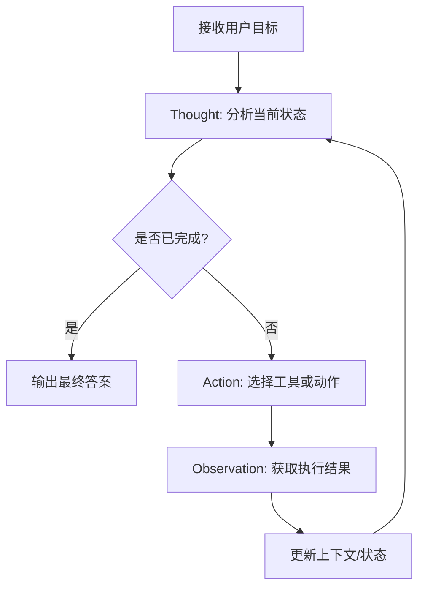
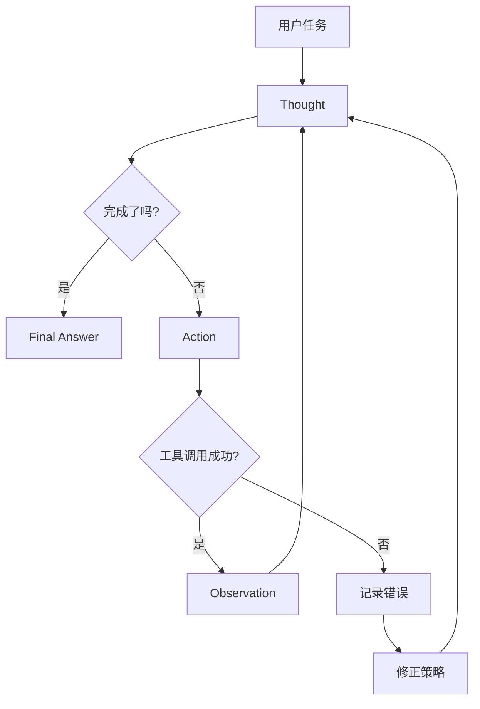
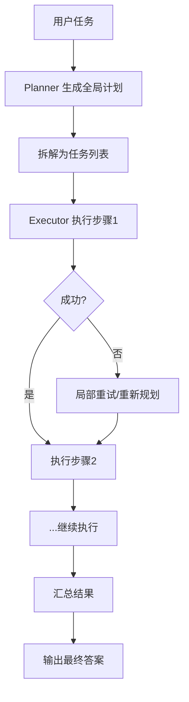
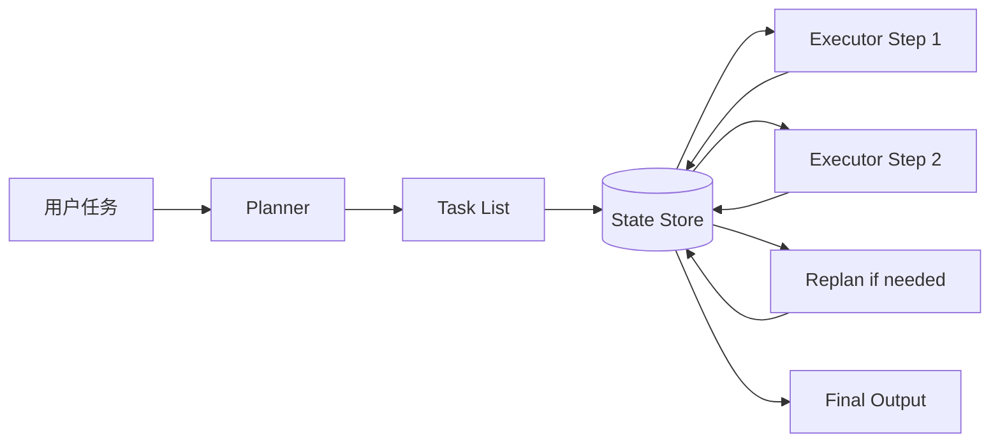
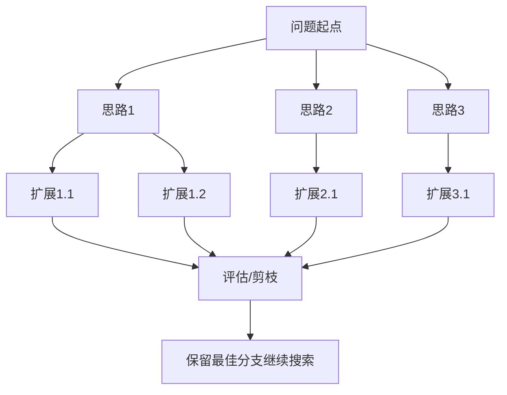
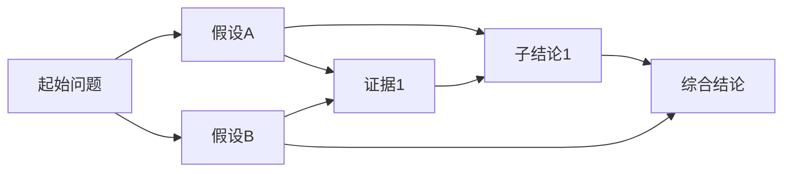
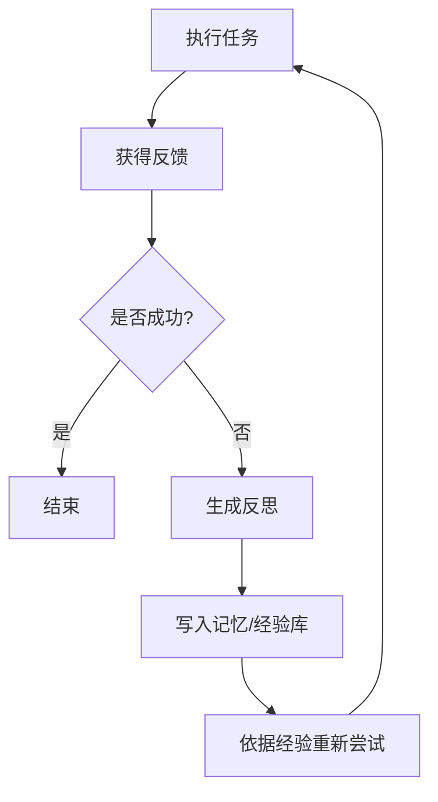
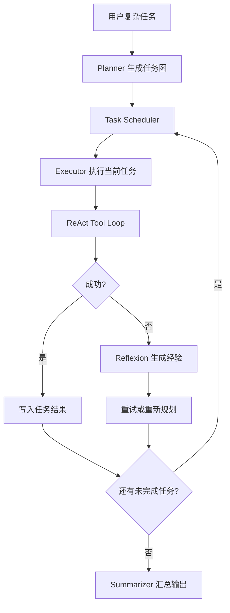

# 第 5 章：规划与推理 — Agent 的思考方式

# 第五章 规划与推理：Agent 的思考方式

前几章我们已经讨论了模型调用、工具使用、记忆管理和多 Agent 协作。到了这一章，问题开始变得更“像人”：

- 用户提出的任务不再是一步就能完成
- Agent 需要自己拆解问题
- 遇到失败时不能只会重试，而要会调整策略
- 面对复杂目标时，需要在多个候选路径里选择更优解

这就是 **规划（Planning）与推理（Reasoning）** 的核心价值。

一个真正可用的 Agent，不只是“调用一次 LLM + 调用一次工具”，而是能够围绕目标持续进行：

1. 理解任务
2. 制定计划
3. 执行动作
4. 观察反馈
5. 修正策略
6. 持续推进直到完成

从工程角度看，这一套机制决定了 Agent 的上限。

本章我们将从最经典的 **ReAct** 模式开始，逐步进入 **Plan-and-Execute**、**Tree of Thoughts / Graph of Thoughts**、**Reflexion**，最后落到一个可运行的实战项目：实现一个能够自动分解复杂任务并逐步执行的 Agent。

---

## 5.1 为什么 Agent 需要“规划与推理”

先看一个简单例子。

用户说：

> 帮我调研“适合中小团队的向量数据库”，要求比较价格、部署方式、是否支持混合检索，并给出推荐方案。

如果我们把这个任务直接丢给普通聊天模型，可能得到一段“看起来合理”的回答。但问题在于：

- 模型可能没有真正查询最新资料
- 价格信息可能过时
- “支持混合检索”可能是推测，不是证据
- 推荐方案缺少透明推理过程

而一个具备规划能力的 Agent 会这样处理：

1. 明确调研目标和对比维度
2. 列出候选数据库
3. 分别搜索每个产品的官网或文档
4. 提取价格、部署方式、检索能力
5. 汇总成结构化对比表
6. 根据信息充分性给出推荐
7. 如果某项信息缺失，继续补查

你会发现，这不是一次“生成”，而是一段 **任务推进过程**。

规划与推理的本质就是让 Agent 从“单轮回答器”变成“目标驱动执行器”。

---

## 5.2 ReAct 模式：思考 → 行动 → 观察 的循环

在 Agent 领域，**ReAct** 是最经典、最实用的模式之一。它的名字来自：

- **Reasoning**：推理、思考
- **Acting**：行动、调用工具

它强调 Agent 不是一直闷头思考，也不是盲目调用工具，而是在一个循环里不断推进：

**思考（Thought）→ 行动（Action）→ 观察（Observation）**

---

### 5.2.1 ReAct 的基本思想

ReAct 的核心思想很简单：

- 模型先思考当前应做什么
- 决定调用哪个工具
- 获取工具返回结果
- 再根据结果进行下一轮思考
- 直到任务完成

它比“直接让模型输出答案”更适合以下场景：

- 需要多步工具调用
- 每一步依赖上一步结果
- 中间可能出现错误，需要修正
- 需要动态探索，而不是一开始就知道完整路径

例如：

> 用户：帮我找到 TypeScript 里处理 CSV 的流行库，并给出 npm 下载量最高的前三个。

Agent 的可能执行过程：

1. Thought：先搜索“TypeScript CSV library”
2. Action：调用搜索工具
3. Observation：得到候选库列表
4. Thought：需要确认 npm 下载量
5. Action：逐个查询 npm 信息
6. Observation：获得下载量
7. Thought：可以排序并汇总答案
8. Final Answer：输出结果

---

### 5.2.2 ReAct 的流程图

下面是一个典型的 ReAct 循环流程：



如果加入错误处理，流程会更接近生产环境：



---

### 5.2.3 ReAct 的工程提示词设计

在工程上，我们通常不会让模型随意输出自然语言，而是要求它按结构化格式返回。例如：

```text
你是一个任务执行 Agent。
请在每一步输出以下 JSON 之一：

1. 如果需要调用工具：
{
  "type": "action",
  "thought": "简短说明为什么要这么做",
  "tool": "search",
  "input": { "query": "..." }
}

2. 如果任务已完成：
{
  "type": "final",
  "thought": "简短说明为什么现在可以结束",
  "answer": "最终回答"
}
```

这里有两个关键点：

1. **思考可控化**
   - 不要求模型输出长篇内部推理
   - 只要求简短、可审计的“决策理由”
2. **动作结构化**
   - 工具调用必须符合 JSON Schema
   - 方便程序解析、校验和执行

这就是“推理工程化”的第一步：**把不可控的自由文本，变成可执行状态机的一部分**。

---

### 5.2.4 TypeScript 实现一个最小 ReAct Agent

下面实现一个可运行的最小版本。为了便于演示，我们假设有两个工具：

- `searchWeb(query)`：搜索网页
- `getPage(url)`：获取页面内容

我们用 OpenAI 兼容接口风格演示，代码是可运行的 Node.js/TypeScript。

```ts
// src/react-agent.ts
import OpenAI from "openai";

const client = new OpenAI({
  apiKey: process.env.OPENAI_API_KEY,
});

type ToolCall =
  | {
      type: "action";
      thought: string;
      tool: "search" | "get_page";
      input: Record<string, any>;
    }
  | {
      type: "final";
      thought: string;
      answer: string;
    };

async function searchWeb(query: string) {
  // 示例中使用 mock，真实项目可替换为 SerpAPI、Tavily、Firecrawl 等
  return [
    {
      title: "fast-csv",
      url: "https://c2fo.github.io/fast-csv/",
      snippet: "CSV parser/formatter for Node.js",
    },
    {
      title: "csv-parse",
      url: "https://csv.js.org/parse/",
      snippet: "CSV parsing implementing Node.js stream API",
    },
    {
      title: "Papa Parse",
      url: "https://www.papaparse.com/",
      snippet: "Powerful in-browser CSV parser",
    },
  ];
}

async function getPage(url: string) {
  const pages: Record<string, string> = {
    "https://c2fo.github.io/fast-csv/":
      "fast-csv is a CSV parser and formatter for Node.js with streams support.",
    "https://csv.js.org/parse/":
      "csv-parse is a mature CSV parser for Node.js and browser environments.",
    "https://www.papaparse.com/":
      "Papa Parse is a popular CSV parser focused on browser usage.",
  };
  return pages[url] ?? "Page content not found.";
}

async function callModel(messages: OpenAI.Chat.Completions.ChatCompletionMessageParam[]) {
  const response = await client.chat.completions.create({
    model: "gpt-4o-mini",
    temperature: 0.2,
    response_format: { type: "json_object" },
    messages,
  });

  const content = response.choices[0]?.message?.content ?? "{}";
  return JSON.parse(content) as ToolCall;
}

export async function runReActAgent(userTask: string) {
  const messages: OpenAI.Chat.Completions.ChatCompletionMessageParam[] = [
    {
      role: "system",
      content: `你是一个 ReAct Agent。
你必须输出 JSON。
可用工具：
1. search: 输入 {"query": string}
2. get_page: 输入 {"url": string}

输出格式：
如果需要调用工具：
{"type":"action","thought":"...","tool":"search|get_page","input":{...}}

如果已完成：
{"type":"final","thought":"...","answer":"..."}

要求：
- thought 保持简洁
- 一次只调用一个工具
- 当信息足够时立刻给出最终答案`,
    },
    {
      role: "user",
      content: userTask,
    },
  ];

  for (let step = 0; step < 8; step++) {
    const decision = await callModel(messages);
    console.log(`\n[Step ${step + 1}]`, decision);

    if (decision.type === "final") {
      return decision.answer;
    }

    let observation: any;
    try {
      if (decision.tool === "search") {
        observation = await searchWeb(String(decision.input.query));
      } else if (decision.tool === "get_page") {
        observation = await getPage(String(decision.input.url));
      } else {
        observation = { error: `Unknown tool: ${decision.tool}` };
      }
    } catch (err: any) {
      observation = { error: err.message ?? String(err) };
    }

    messages.push({
      role: "assistant",
      content: JSON.stringify(decision),
    });
    messages.push({
      role: "user",
      content: `Observation: ${JSON.stringify(observation)}`,
    });
  }

  throw new Error("Agent exceeded max steps");
}

if (require.main === module) {
  runReActAgent("帮我找出适合 TypeScript 的 CSV 库，并简单比较它们的适用场景")
    .then((result) => {
      console.log("\nFinal Result:\n", result);
    })
    .catch(console.error);
}
```

安装依赖：

```bash
npm install openai
```

运行：

```bash
OPENAI_API_KEY=your_key npx ts-node src/react-agent.ts
```

---

### 5.2.5 ReAct 的优点与局限

| 优点 | 说明 |
|---|---|
| 简单直接 | 很容易从单轮对话升级为多步 Agent |
| 动态性强 | 可以根据观察结果临时调整策略 |
| 适合工具调用 | 搜索、浏览、数据库查询、执行代码都很自然 |
| 可解释 | 每一步都有“thought”和“action” |

但它也有明显局限：

| 局限 | 说明 |
|---|---|
| 容易短视 | 只看当前一步，缺乏全局计划 |
| 步数可能膨胀 | 遇到复杂任务时反复试错 |
| 不稳定 | 不同轮次可能改变方向 |
| 成本较高 | 每一步都要调用模型 |

这就引出了第二种模式：**Plan-and-Execute**。

---

## 5.3 Plan-and-Execute：先规划，再执行

ReAct 的问题在于“边走边想”，适合探索型任务，但面对长流程任务时，可能会显得缺乏全局性。

**Plan-and-Execute** 则采用两阶段方法：

1. **Plan 阶段**：先生成一个完整计划
2. **Execute 阶段**：按计划逐步执行，必要时局部修正

这种方式非常适合：

- 多步骤任务
- 步骤之间依赖关系明确
- 需要控制成本和执行路径
- 希望输出可审查的任务计划

---

### 5.3.1 两阶段思路

例如用户说：

> 帮我写一篇关于 RAG 架构演进的技术博客，并附上参考资料。

Plan-and-Execute 的典型过程：

**Plan 阶段**
- 明确文章目标读者
- 列出提纲
- 收集参考资料
- 按提纲写初稿
- 校对术语一致性
- 输出 Markdown

**Execute 阶段**
- 逐步完成每一步
- 对失败的步骤单独重试
- 不必在每一轮都重新思考整个问题

---

### 5.3.2 Plan-and-Execute 流程图



如果加入状态存储与检查点：



---

### 5.3.3 TypeScript 实现 Plan-and-Execute Agent

下面实现一个较完整的版本。这个 Agent 会：

- 先生成任务清单
- 再依次执行每个任务
- 把执行结果写入状态
- 遇到失败时可重新规划

```ts
// src/plan-execute-agent.ts
import OpenAI from "openai";

const client = new OpenAI({
  apiKey: process.env.OPENAI_API_KEY,
});

type PlanItem = {
  id: string;
  title: string;
  description: string;
  dependsOn: string[];
};

type Plan = {
  goal: string;
  tasks: PlanItem[];
};

type ExecutionResult = {
  taskId: string;
  success: boolean;
  output: string;
};

async function createPlan(goal: string): Promise<Plan> {
  const res = await client.chat.completions.create({
    model: "gpt-4o-mini",
    temperature: 0.2,
    response_format: { type: "json_object" },
    messages: [
      {
        role: "system",
        content: `你是一个任务规划器。
请把用户目标拆解为 3-6 个可执行任务，输出 JSON:
{
  "goal": "...",
  "tasks": [
    {
      "id": "task-1",
      "title": "...",
      "description": "...",
      "dependsOn": []
    }
  ]
}
要求：
- 任务具体、可执行
- 尽量减少循环依赖
- 不要输出无意义步骤`,
      },
      { role: "user", content: goal },
    ],
  });

  return JSON.parse(res.choices[0].message.content || "{}") as Plan;
}

async function executeTask(task: PlanItem, context: ExecutionResult[]): Promise<ExecutionResult> {
  const res = await client.chat.completions.create({
    model: "gpt-4o-mini",
    temperature: 0.3,
    messages: [
      {
        role: "system",
        content: `你是一个任务执行器。请完成给定任务，并输出简洁结果。
如果上下文中已有前置任务结果，请充分利用。`,
      },
      {
        role: "user",
        content: JSON.stringify({
          task,
          context,
        }),
      },
    ],
  });

  return {
    taskId: task.id,
    success: true,
    output: res.choices[0].message.content || "",
  };
}

function getExecutableTasks(plan: Plan, doneSet: Set<string>) {
  return plan.tasks.filter(
    (task) =>
      !doneSet.has(task.id) &&
      task.dependsOn.every((dep) => doneSet.has(dep))
  );
}

export async function runPlanAndExecute(goal: string) {
  const plan = await createPlan(goal);
  console.log("Generated Plan:\n", JSON.stringify(plan, null, 2));

  const results: ExecutionResult[] = [];
  const doneSet = new Set<string>();

  while (doneSet.size < plan.tasks.length) {
    const readyTasks = getExecutableTasks(plan, doneSet);

    if (readyTasks.length === 0) {
      throw new Error("No executable tasks found. Plan may contain circular dependencies.");
    }

    for (const task of readyTasks) {
      const result = await executeTask(task, results);
      results.push(result);
      doneSet.add(task.id);
      console.log(`\nExecuted ${task.id}: ${task.title}\n${result.output}`);
    }
  }

  const finalRes = await client.chat.completions.create({
    model: "gpt-4o-mini",
    temperature: 0.2,
    messages: [
      {
        role: "system",
        content: "你是一个总结器，请根据所有任务执行结果输出最终结果。",
      },
      {
        role: "user",
        content: JSON.stringify({
          goal,
          plan,
          results,
        }),
      },
    ],
  });

  return finalRes.choices[0].message.content || "";
}

if (require.main === module) {
  runPlanAndExecute("为一个 10 人技术团队调研适合自托管部署的向量数据库，并给出选型建议")
    .then((result) => {
      console.log("\nFinal Output:\n", result);
    })
    .catch(console.error);
}
```

---

### 5.3.4 什么时候 ReAct 更好，什么时候 Plan-and-Execute 更好

| 场景 | 更适合的方法 |
|---|---|
| 需要探索未知信息 | ReAct |
| 多轮搜索和观察驱动 | ReAct |
| 长流程、结构清晰的任务 | Plan-and-Execute |
| 希望提前审查计划 | Plan-and-Execute |
| 成本敏感，希望减少无效步骤 | Plan-and-Execute |
| 复杂环境、变化较快 | ReAct 或混合模式 |

实际上，生产中常见的是 **混合方案**：

- 用 Planner 先出全局计划
- 每个子任务内部再用 ReAct 进行工具调用和探索

这类架构通常比纯 ReAct 更稳定，也比纯静态计划更灵活。

---

## 5.4 Tree of Thoughts / Graph of Thoughts：高级推理

当任务足够复杂时，仅靠“一条链路往前走”可能不够。

例如：

- 设计系统架构
- 复杂数学证明
- 多方案选型
- 代码调优与排错
- 博弈型或搜索型问题

此时，Agent 需要的不只是一步一步向前，而是：

- 同时考虑多个候选思路
- 比较中间状态的优劣
- 必要时剪枝
- 甚至回溯

这就是 **Tree of Thoughts（ToT）** 和 **Graph of Thoughts（GoT）** 的价值。

---

### 5.4.1 Tree of Thoughts

ToT 可以理解为：把“思考过程”从一条线变成一棵树。

普通链式推理：

```text
想法 A -> 想法 B -> 想法 C
```

Tree of Thoughts：

```text
         起点
       /  |  \
     A1  A2  A3
     |   |   |
    B1  B2  B3
       / \
     C1  C2
```

每个节点代表一个“候选思路”或“中间状态”，Agent 会：

1. 生成多个候选 thought
2. 评估每个 thought 的质量
3. 保留最有前途的分支
4. 继续扩展
5. 最终选择最佳路径

---

### 5.4.2 Graph of Thoughts

GoT 比 ToT 更进一步。树结构要求每个节点只有一个父节点，而图结构允许：

- 多个思路合并
- 不同路径共享中间结论
- 回跳到已有状态
- 形成更灵活的搜索空间

从工程上看，GoT 更适合：

- 复杂信息整合
- 多视角分析
- 论证网络构建
- 多源证据聚合

但实现复杂度也更高。

---

### 5.4.3 ToT / GoT 流程图

Tree of Thoughts：



Graph of Thoughts：



---

### 5.4.4 一个简化版 ToT 搜索器

下面用 TypeScript 写一个“候选计划搜索器”。它不是真正的通用推理框架，但足以体现 ToT 的工程实现方法：

```ts
// src/tot-planner.ts
import OpenAI from "openai";

const client = new OpenAI({
  apiKey: process.env.OPENAI_API_KEY,
});

type Candidate = {
  thought: string;
  score: number;
};

async function generateCandidates(problem: string, context: string, k = 3): Promise<Candidate[]> {
  const res = await client.chat.completions.create({
    model: "gpt-4o-mini",
    temperature: 0.7,
    response_format: { type: "json_object" },
    messages: [
      {
        role: "system",
        content: `你是一个问题求解器。
请针对当前问题生成 ${k} 个候选下一步思路，并为每个思路打分（0-10）。
输出 JSON:
{
  "candidates": [
    {"thought":"...", "score": 8}
  ]
}`,
      },
      {
        role: "user",
        content: JSON.stringify({ problem, context }),
      },
    ],
  });

  const data = JSON.parse(res.choices[0].message.content || "{}");
  return data.candidates ?? [];
}

async function selectBestPath(problem: string, depth = 3, beamWidth = 2) {
  let frontier = [{ path: [], context: "" }];

  for (let level = 0; level < depth; level++) {
    const expanded: { path: string[]; context: string; score: number }[] = [];

    for (const node of frontier) {
      const candidates = await generateCandidates(problem, node.context, 3);
      for (const c of candidates) {
        expanded.push({
          path: [...node.path, c.thought],
          context: `${node.context}\n${c.thought}`.trim(),
          score: c.score,
        });
      }
    }

    expanded.sort((a, b) => b.score - a.score);
    frontier = expanded.slice(0, beamWidth).map((x) => ({
      path: x.path,
      context: x.context,
    }));
  }

  return frontier;
}

if (require.main === module) {
  selectBestPath("如何为中型 SaaS 系统设计一个可扩展的 RAG 平台", 3, 2)
    .then((paths) => {
      console.log(JSON.stringify(paths, null, 2));
    })
    .catch(console.error);
}
```

这个实现用了一个常见策略：**Beam Search（束搜索）**。  
它不会保留所有分支，而是每一层只保留评分最高的若干条路径，从而在效果和成本之间取得平衡。

---

### 5.4.5 高级推理的工程边界

ToT / GoT 很强，但不要滥用。它们的代价包括：

- 调用次数显著增加
- 延迟变长
- 评估器本身也可能不稳定
- 调试复杂度高
- 成本可能呈指数增长

因此它更适合这些高价值任务：

- 方案设计
- 高风险决策
- 自动代码修复
- 复杂研究型任务
- 长链路、多候选搜索任务

而不是普通问答、简单摘要、日常 CRUD 自动化。

---

## 5.5 自我反思（Reflexion）：Agent 如何从错误中学习

一个没有反思能力的 Agent，失败时往往只会：

- 重复同样的错误
- 换个措辞再试一次
- 或者陷入无意义循环

**Reflexion** 的思想是：  
Agent 在失败后，不只是“再来一次”，而是显式分析：

- 为什么失败？
- 哪一步出了问题？
- 下次该调整什么策略？

---

### 5.5.1 Reflexion 的核心循环

Reflexion 一般包含三部分：

1. **执行**
2. **反馈**
3. **反思并写入经验**

下一次执行时，Agent 会优先参考这些经验。

流程如下：



反思内容通常不是“长篇大论”，而是短小、可行动的经验规则，比如：

- “在调用 SQL 工具前，先检查表名是否存在”
- “网页搜索结果不可靠时，优先访问官方文档”
- “如果 API 返回 429，先退避重试而不是立即换模型”

这些规则对后续任务非常有价值。

---

### 5.5.2 Python 实现一个简单 Reflexion 示例

下面用 Python 写一个简化版示例。场景是假设 Agent 在生成 SQL 时反复出错，我们让它把错误总结成经验。

```python
# reflexion_demo.py
from typing import List, Dict

class ReflectionMemory:
    def __init__(self):
        self.rules: List[str] = []

    def add_rule(self, rule: str):
        if rule not in self.rules:
            self.rules.append(rule)

    def get_rules(self) -> List[str]:
        return self.rules

def run_sql_task(question: str, memory: ReflectionMemory) -> Dict:
    # 模拟执行：如果没有“先检查表名”经验，就失败
    has_rule = any("检查表名" in r for r in memory.get_rules())
    if not has_rule:
        return {
            "success": False,
            "error": "SQL execution failed: table 'orderss' does not exist"
        }
    return {
        "success": True,
        "result": "Query succeeded: total orders = 128"
    }

def reflect_on_failure(question: str, error: str) -> str:
    if "does not exist" in error:
        return "生成 SQL 前先检查表名和字段名是否真实存在。"
    return "失败后先分析错误类型，再决定重试策略。"

def main():
    memory = ReflectionMemory()
    question = "查询订单总数"

    for attempt in range(3):
        print(f"\nAttempt {attempt + 1}")
        print("Memory rules:", memory.get_rules())

        result = run_sql_task(question, memory)
        print("Result:", result)

        if result["success"]:
            print("Task completed.")
            break

        rule = reflect_on_failure(question, result["error"])
        print("Reflection:", rule)
        memory.add_rule(rule)

if __name__ == "__main__":
    main()
```

运行结果大致会是：

```bash
Attempt 1
Memory rules: []
Result: {'success': False, 'error': "SQL execution failed: table 'orderss' does not exist"}
Reflection: 生成 SQL 前先检查表名和字段名是否真实存在。

Attempt 2
Memory rules: ['生成 SQL 前先检查表名和字段名是否真实存在。']
Result: {'success': True, 'result': 'Query succeeded: total orders = 128'}
Task completed.
```

这个例子很小，但已经体现了 Reflexion 的工程价值：

- 经验显式化
- 可持久化
- 可跨任务复用
- 能减少重复错误

---

## 5.6 Chain-of-Thought 的工程化：Thinking Protocol

很多开发者一提“推理”，就想到 **Chain-of-Thought（CoT）**。它的核心思想是：让模型逐步思考，而不是直接给结论。

但在真实系统里，直接要求模型“把完整思维过程写出来”存在几个问题：

1. **成本高**：输出太长，token 浪费严重
2. **不稳定**：不同 prompt 下风格变化大
3. **难审计**：自然语言推理不好解析
4. **有泄露风险**：某些场景不希望暴露全部内部推理
5. **不利于程序控制**：系统难以根据自由文本作分支判断

所以在工程里，我们更关心的是 **Thinking Protocol**：  
不是让模型“自由地想很多”，而是规定它“按什么格式思考、思考到什么粒度、思考结果如何用于执行”。

---

### 5.6.1 Thinking Protocol 的目标

一个好的 Thinking Protocol 应该满足：

- **结构化**：易解析、易存储
- **简洁**：只保留必要推理摘要
- **可审计**：人和程序都能检查
- **可控**：不同阶段有不同推理深度
- **可中断**：系统能在任意步骤接管

例如，我们不要求模型输出完整 CoT，而是要求输出：

```json
{
  "goal": "完成用户调研任务",
  "current_state": "已收集 2 个候选产品",
  "next_step": "搜索第三个候选产品官网",
  "reason": "目前样本不足，无法形成可信对比",
  "confidence": 0.81
}
```

这就是工程化思维协议：**保留决策信息，不暴露冗长内部展开**。

---

### 5.6.2 一个可落地的 Thinking Protocol 设计

下面给出一个常用协议：

| 字段 | 说明 |
|---|---|
| goal | 当前总目标 |
| subgoal | 当前子目标 |
| state_summary | 当前上下文摘要 |
| decision | 下一步决策 |
| reason | 简洁原因 |
| tool | 需要调用的工具 |
| tool_input | 工具参数 |
| expected_result | 预期观察结果 |
| confidence | 决策信心 |
| done | 是否完成 |

示例：

```json
{
  "goal": "调研自托管向量数据库",
  "subgoal": "收集候选方案",
  "state_summary": "已确认 Milvus 和 Qdrant，缺少 Weaviate 信息",
  "decision": "搜索 Weaviate 官方部署文档",
  "reason": "需要补齐候选集，避免推荐结论偏差",
  "tool": "search",
  "tool_input": {
    "query": "Weaviate self hosted deployment official docs"
  },
  "expected_result": "找到官方部署方式说明",
  "confidence": 0.87,
  "done": false
}
```

---

### 5.6.3 Thinking Protocol 的 TypeScript 实现

```ts
// src/thinking-protocol.ts
import OpenAI from "openai";

const client = new OpenAI({
  apiKey: process.env.OPENAI_API_KEY,
});

type ThinkingStep = {
  goal: string;
  subgoal: string;
  state_summary: string;
  decision: string;
  reason: string;
  tool?: string;
  tool_input?: Record<string, any>;
  expected_result?: string;
  confidence: number;
  done: boolean;
};

export async function nextThinkingStep(input: {
  goal: string;
  history: string[];
  observations: string[];
}): Promise<ThinkingStep> {
  const res = await client.chat.completions.create({
    model: "gpt-4o-mini",
    temperature: 0.2,
    response_format: { type: "json_object" },
    messages: [
      {
        role: "system",
        content: `你是一个 Agent 决策器。
请输出一个 JSON，描述下一步应该如何推进任务。
要求：
- reason 保持简洁，不超过 50 字
- confidence 为 0 到 1 之间的小数
- 如果任务已完成，done=true，且不要再提供 tool`,
      },
      {
        role: "user",
        content: JSON.stringify(input),
      },
    ],
  });

  return JSON.parse(res.choices[0].message.content || "{}") as ThinkingStep;
}
```

这个协议非常适合与：

- 工作流引擎
- 状态机
- 可观测平台
- 审批系统
- 人工接管机制

进行集成。

---

## 5.7 实战：实现一个能自动分解复杂任务并逐步执行的 Agent

下面我们来实现本章的核心项目：  
一个 **Task Decomposition Agent**，它具备如下能力：

1. 接收复杂用户目标
2. 自动生成任务计划
3. 根据依赖关系执行任务
4. 每个任务内部可进行 ReAct 式工具调用
5. 失败后记录反思
6. 最终汇总为结构化结果

这实际上是把前面几种思想组合起来：

- 全局层：Plan-and-Execute
- 局部层：ReAct
- 失败恢复：Reflexion
- 推理输出：Thinking Protocol

---

### 5.7.1 架构设计



---

### 5.7.2 实现代码

为了保证篇幅可读，我们实现一个简化但完整可运行的版本。

```ts
// src/complex-agent.ts
import OpenAI from "openai";

const client = new OpenAI({
  apiKey: process.env.OPENAI_API_KEY,
});

type Task = {
  id: string;
  title: string;
  description: string;
  dependsOn: string[];
  status: "pending" | "running" | "done" | "failed";
};

type TaskResult = {
  taskId: string;
  output: string;
  success: boolean;
};

type Reflection = {
  taskId: string;
  lesson: string;
};

async function planner(goal: string): Promise<Task[]> {
  const res = await client.chat.completions.create({
    model: "gpt-4o-mini",
    temperature: 0.2,
    response_format: { type: "json_object" },
    messages: [
      {
        role: "system",
        content: `你是任务规划
