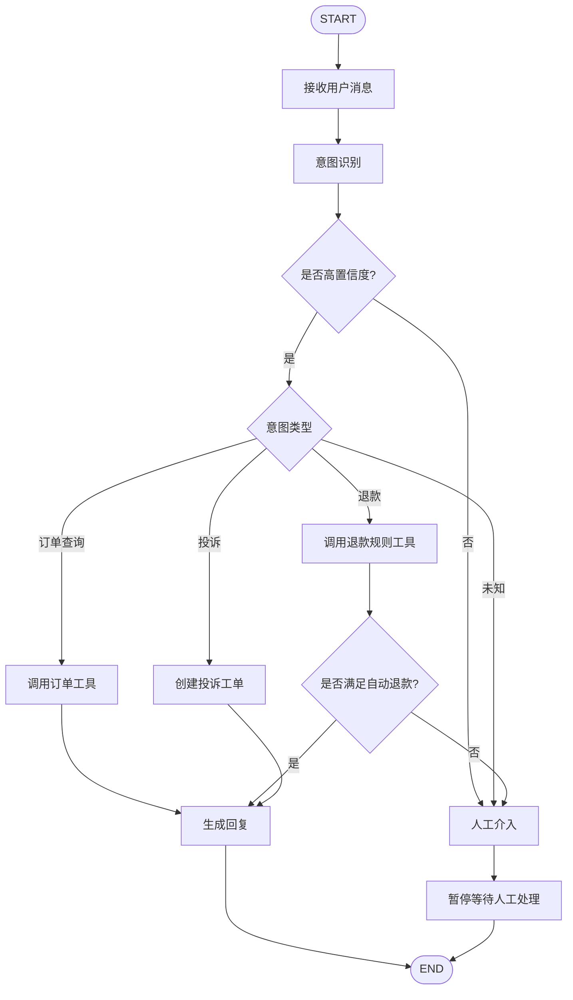
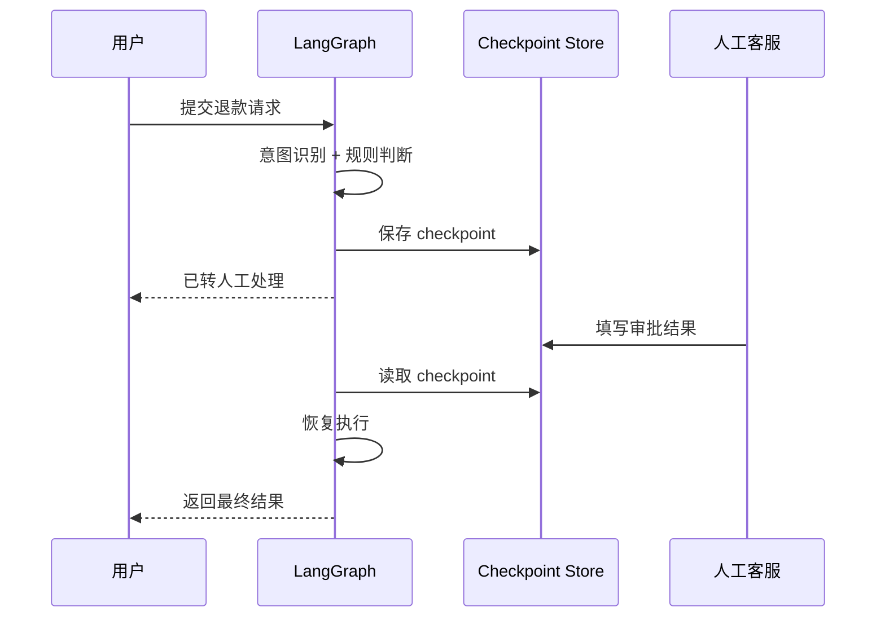

# 第 7 章：LangGraph 深入 — 状态机驱动的 Agent

# 第七章 LangGraph 深入 —— 状态机驱动的 Agent

当 Agent 从“调用一次大模型”演进到“多步推理、调用工具、处理中断、支持人工介入、可恢复执行”时，系统复杂度会迅速上升。  
如果仍然只靠一段串行代码或者把所有逻辑塞进 LangChain 的链式调用里，很快就会遇到几个现实问题：

- 执行路径不固定，流程会分叉
- 状态会越来越多，难以管理
- 某一步失败后，希望从中间恢复，而不是从头再来
- 需要支持 Human-in-the-loop（人工确认、人工接管）
- 需要更强的可观测性，知道当前卡在哪个节点
- 需要在生产环境中稳定运行，而不是一个“能跑的 demo”

这正是 LangGraph 擅长解决的问题。

LangGraph 可以理解为：**面向 Agent 的状态机/工作流框架**。  
它把 Agent 的执行过程抽象成一个带状态的图（Graph）：

- **节点（Node）**：做具体工作
- **边（Edge）**：决定下一个执行步骤
- **状态（State）**：在整个图执行中持续流动和累积的数据
- **检查点（Checkpoint）**：让图执行可以暂停、恢复、持久化

本章会从概念、设计模式、检查点机制，到一个完整的客服 Agent 实战，把 LangGraph 真正讲透。

---

## 7.1 为什么选 LangGraph

在开始之前，先回答一个非常实际的问题：  
**为什么不是纯 LangChain？为什么不是直接写代码？**

---

## 7.1.1 纯 LangChain 的问题

LangChain 很适合做这些事情：

- Prompt 组装
- 模型调用
- 工具封装
- RAG 组件拼接
- 输出解析

如果你的应用是：

- 单轮问答
- 简单 ReAct Agent
- 少量工具调用
- 基本不需要中断恢复

那么 LangChain 已经足够。

但当业务进入“流程型 Agent”阶段，问题就开始出现。

### 典型痛点

#### 1）控制流不清晰

纯 LangChain 常见写法是：

- 一个 chain 套一个 chain
- agent 内部自己决定下一步
- 中间穿插 tool call、parser、memory

最后你会发现：

- 流程到底有几步，不清楚
- 哪些路径可能发生，很难可视化
- 某一步失败后，恢复逻辑难写

#### 2）状态散落

复杂 Agent 一般会维护这些数据：

- 用户原始输入
- 意图分类结果
- 已调用的工具结果
- 是否需要人工介入
- 当前处理轮次
- 错误信息
- 审计日志

如果没有统一的状态容器，这些数据会散落在：

- 函数参数里
- 闭包变量里
- 内存对象里
- callback 上下文里

长期维护非常痛苦。

#### 3）人机交互支持弱

现实里的 Agent 往往不是“自动到底”：

- 遇到退款、投诉、敏感操作，需要人工审批
- 模型置信度低时，希望暂停并等待人工决策
- 用户长时间离线后，后续还要恢复上下文

纯链式结构处理这种“暂停—等待—恢复”并不自然。

---

## 7.1.2 纯代码状态机的问题

另一个极端是：  
“不用框架，我自己写状态机。”

当然可以，而且很多成熟系统最终也会走向自定义编排。但对于大多数 1～3 年经验的工程师，纯手写会很快踩坑。

### 你最终会自己重写这些东西

- 状态对象定义
- 节点执行器
- 路由分发器
- 条件跳转
- 错误重试
- 中断恢复
- 持久化快照
- 可视化
- 运行时上下文隔离
- 子流程复用

换句话说，你会花很多时间在“编排基础设施”上，而不是在业务价值上。

---

## 7.1.3 LangGraph 的优势

LangGraph 介于两者之间：

- 它不像纯 LangChain 那样“流程隐式”
- 也不像纯手写代码那样“所有基础设施都要自己做”

它的核心价值有四点。

### 1）显式控制流

流程图是第一公民。  
你的 Agent 到底有几步、会走哪些分支，一眼能看清。

### 2）统一状态管理

所有节点围绕一个共享状态工作，状态更新可预测、可合并、可持久化。

### 3）天然支持中断与恢复

特别适合：

- 人工审批
- 长流程任务
- 异步等待外部系统回调
- 宕机后断点续跑

### 4）适合生产落地

LangGraph 的思路更接近“工作流引擎 + LLM Agent”，而不仅是一个 Prompt 编排库。  
因此在客服、审批、运营自动化、复杂工具调用场景中更稳。

---

## 7.1.4 适用场景对比

| 方案 | 适合场景 | 优点 | 缺点 |
|---|---|---|---|
| 纯 LangChain | 简单对话、单步工具调用 | 上手快、生态丰富 | 状态和流程复杂后难维护 |
| 纯代码 | 特殊业务、高度定制 | 灵活、性能可控 | 基础设施成本高 |
| LangGraph | 多步流程、分支、人工介入、可恢复任务 | 控制流清晰、状态统一、可持久化 | 需要学习图式思维 |

如果你正在做的是**真正业务级 Agent**，LangGraph 往往是更合理的中间层。

---

# 7.2 核心概念：State、Node、Edge、Conditional Edge、Subgraph

LangGraph 的思想并不复杂。  
可以把它想象成一个“带状态的数据流图”。

---

## 7.2.1 State：图中的共享状态

State 是整个 Graph 的核心。  
每个节点接收当前状态，执行后返回状态增量（patch）或新的状态字段，框架再把这些更新合并回全局状态。

一个典型的客服 Agent 状态可能包括：

- 用户消息
- 意图分类
- 工具结果
- 回复文本
- 是否需要人工介入
- 工单状态
- 执行日志

例如：

```ts
type CustomerServiceState = {
  messages: { role: "user" | "assistant" | "system"; content: string }[];
  userId?: string;
  intent?: "refund" | "order_status" | "complaint" | "unknown";
  intentConfidence?: number;
  toolResult?: unknown;
  reply?: string;
  needsHuman?: boolean;
  humanReason?: string;
  ticketId?: string;
  status?: "running" | "waiting_human" | "done" | "error";
  logs: string[];
};
```

你可以把它理解为：  
**Agent 在运行过程中的“全部上下文真相”**。

---

## 7.2.2 Node：处理状态的函数

Node 是图中的执行单元。  
本质上就是一个函数：

- 输入：当前 State
- 输出：对 State 的更新

例如，一个“意图识别节点”：

```ts
async function classifyIntentNode(state: CustomerServiceState) {
  return {
    intent: "refund",
    intentConfidence: 0.92,
    logs: [...state.logs, "意图识别完成：refund"],
  };
}
```

Node 应尽量做到：

- 职责单一
- 输入输出明确
- 幂等或尽量接近幂等
- 副作用可控

---

## 7.2.3 Edge：固定跳转

Edge 表示执行完一个节点后，下一步去哪。

例如：

- `START -> classify_intent`
- `fetch_order -> compose_reply`
- `compose_reply -> END`

这是最简单的线性流程。

---

## 7.2.4 Conditional Edge：条件跳转

现实业务通常不是固定流程。  
分类结果不同，后续路径不同。

例如：

- 如果意图是 `order_status`，走“查询订单工具”
- 如果意图是 `refund`，走“退款规则判断”
- 如果置信度低，走“人工介入”
- 如果用户在投诉，走“投诉工单流程”

这就需要条件边。

条件边可以把某个节点的输出映射到不同分支，构成状态机的“决策点”。

---

## 7.2.5 Subgraph：子图复用

当流程复杂后，你不应该把所有节点平铺在一个大图里。  
更好的方式是把一段可复用流程封装成 Subgraph。

例如客服系统中，可以把这些做成子图：

- 退款处理子图
- 投诉处理子图
- 订单查询子图
- 人工接管子图

这样主图只负责高层路由，子图负责具体业务细节。

这和软件工程里的“模块化”本质一致。

---

## 7.2.6 一个直观状态图

下面是本章后面会实现的客服 Agent 流程图：



这个图已经体现出 LangGraph 的几个关键能力：

- 统一状态贯穿全局
- 根据意图动态路由
- 可以中断到人工介入
- 支持多种工具路径
- 适合做持久化恢复

---

# 7.3 状态设计模式：Reducer、Annotation、Channel

LangGraph 不是简单地“有个 state 对象”就结束了。  
真正难的是：**状态怎么设计，才能既好用又可扩展。**

这一节讲三个非常重要的模式：

- Reducer
- Annotation
- Channel

---

## 7.3.1 Reducer：状态合并策略

在图执行过程中，不同节点会返回局部更新。  
这些更新如何合并到原状态？这就是 Reducer 关注的问题。

### 为什么需要 Reducer

如果状态里有数组，比如 `logs`、`messages`，不同节点可能都想追加内容。  
如果只是简单覆盖，会丢数据。

比如：

- 节点 A 返回：`logs = ["进入分类"]`
- 节点 B 返回：`logs = ["调用工具"]`

如果默认是赋值覆盖，最终只剩下一份。  
而我们通常想要的是追加合并。

### 常见 Reducer 策略

| 状态字段 | 合并方式 |
|---|---|
| `intent` | 直接覆盖 |
| `reply` | 直接覆盖 |
| `logs` | 数组追加 |
| `messages` | 消息追加 |
| `toolResult` | 直接覆盖或结构化合并 |

Reducer 的价值是：  
**把“状态如何演化”这件事显式定义出来。**

---

## 7.3.2 Annotation：为状态字段提供结构与规则

LangGraph 中常用 Annotation 来定义状态结构。  
你可以把它理解为“带合并规则的状态 Schema”。

这比直接写一个普通 TypeScript type 更进一步，因为它不仅描述字段类型，还能描述：

- 默认值
- reducer
- 状态更新规则

这样状态就不是“随便一个对象”，而是“有约束的状态容器”。

---

## 7.3.3 Channel：按语义拆分状态流

Channel 可以理解为状态中的“专用通道”。  
不同通道承载不同类型的信息，避免所有东西都堆在一个大对象里。

例如在 Agent 中常见几类 channel：

- **messages channel**：对话消息
- **control channel**：流程控制字段，如 `status`、`nextAction`
- **tool channel**：工具调用结果
- **audit channel**：日志、trace、错误信息
- **human channel**：人工审批、人工备注、人工决策结果

### 为什么 Channel 很重要

当系统变复杂时，最大的敌人是“语义混乱”。  
如果所有节点都能随意修改所有字段，会迅速失控。

Channel 的好处是：

- 让状态更可读
- 降低误修改风险
- 更容易做权限控制和审计
- 便于后续拆分子图

---

## 7.3.4 客服 Agent 的状态设计建议

下面给出一个更合理的状态结构。

```ts
type Message = {
  role: "system" | "user" | "assistant";
  content: string;
};

type CustomerServiceState = {
  input: {
    userId: string;
    message: string;
  };
  conversation: {
    messages: Message[];
  };
  classification: {
    intent?: "refund" | "order_status" | "complaint" | "unknown";
    confidence?: number;
    reason?: string;
  };
  tools: {
    orderStatus?: {
      orderId: string;
      status: string;
      eta?: string;
    };
    refundCheck?: {
      eligible: boolean;
      reason: string;
      amount?: number;
    };
    complaintTicket?: {
      ticketId: string;
      priority: "low" | "medium" | "high";
    };
  };
  human: {
    required: boolean;
    reason?: string;
    decision?: "approved" | "rejected" | "manual_reply";
    note?: string;
  };
  output: {
    reply?: string;
  };
  runtime: {
    status: "running" | "waiting_human" | "done" | "error";
    currentNode?: string;
    logs: string[];
    error?: string;
  };
};
```

这种设计比把所有字段摊平更适合生产使用。

---

# 7.4 检查点与持久化：断点续跑、人机交互暂停

LangGraph 在生产里最有价值的能力之一，就是 **Checkpoint**。

很多 Agent 框架把“单次运行”视为默认模型：  
输入来了，跑一遍，输出结果，结束。

但真实业务远不止这样。

---

## 7.4.1 为什么需要检查点

### 场景 1：人工审批

用户说：“我要退款 4999 元。”

系统判断：

- 金额高
- 用户情绪激动
- 需要客服主管确认

这时 Agent 不能继续自动执行，而应：

1. 保存当前状态
2. 暂停运行
3. 等待人工处理
4. 人工给出决策后恢复执行

### 场景 2：外部系统延迟

某个节点要调用 ERP 或工单系统，而外部接口可能几分钟后才返回。  
系统应该能挂起，而不是一直占着进程。

### 场景 3：进程宕机或重启

如果 Agent 运行到一半服务重启，最好能从最近一次 checkpoint 恢复，而不是从头再来。

---

## 7.4.2 Checkpoint 的基本思路

本质上，检查点就是在图执行的关键节点，把当前状态快照持久化下来。

通常要保存：

- 线程 ID / 会话 ID
- 当前状态 State
- 当前执行节点
- 执行历史
- 中断原因
- 时间戳

恢复时再把这些内容读出来，继续往后跑。

---

## 7.4.3 人机交互暂停的典型流程



这套机制让 Agent 真正具备“长生命周期流程”的能力。

---

## 7.4.4 持久化存储选型

常见选择如下：

| 存储 | 适合场景 | 优点 | 缺点 |
|---|---|---|---|
| 内存 | 本地开发 | 简单 | 重启即丢失 |
| SQLite | 单机 demo / 小规模服务 | 轻量 | 扩展性一般 |
| PostgreSQL | 生产常用 | 可靠、事务性强 | 需要运维 |
| Redis | 高速缓存/临时状态 | 快 | 不适合长期审计快照 |
| S3/对象存储 | 大状态快照归档 | 成本低 | 查询能力弱 |

对于生产环境，通常建议：

- **状态元数据** 放 PostgreSQL
- **大对象日志/附件** 放对象存储
- **热点会话** 可放 Redis 做加速

---

# 7.5 实战：从零构建一个客服 Agent

下面进入本章核心部分：  
我们从零实现一个 **客服 Agent**，具备以下能力：

1. 接收用户消息
2. 识别意图
3. 根据意图调用不同工具
4. 对低置信度或高风险请求转人工
5. 支持暂停和恢复
6. 输出最终回复

为了保证代码易于运行，这里采用：

- TypeScript
- Node.js
- `@langchain/langgraph`
- `@langchain/openai`
- 本地内存版 checkpoint（便于演示）

你后续可以很容易替换成数据库持久化。

---

## 7.5.1 安装依赖

```bash
mkdir ch07-langgraph-cs-agent
cd ch07-langgraph-cs-agent
npm init -y
npm install @langchain/langgraph @langchain/openai zod dotenv
npm install -D typescript tsx @types/node
```

初始化 `tsconfig.json`：

```json
{
  "compilerOptions": {
    "target": "ES2022",
    "module": "NodeNext",
    "moduleResolution": "NodeNext",
    "strict": true,
    "esModuleInterop": true,
    "skipLibCheck": true
  }
}
```

创建 `.env`：

```env
OPENAI_API_KEY=your_api_key
```

---

## 7.5.2 完整代码

下面是一份可运行的完整 TypeScript 示例。

> 文件：`src/customer-service-agent.ts`

```ts
import "dotenv/config";
import { ChatOpenAI } from "@langchain/openai";
import { Annotation, END, MemorySaver, START, StateGraph } from "@langchain/langgraph";
import { z } from "zod";

type Intent = "refund" | "order_status" | "complaint" | "unknown";
type HumanDecision = "approved" | "rejected" | "manual_reply";

const MessageSchema = z.object({
  role: z.enum(["system", "user", "assistant"]),
  content: z.string(),
});

const StateAnnotation = Annotation.Root({
  input: Annotation<{
    userId: string;
    message: string;
  }>({
    reducer: (_prev, next) => next,
  }),

  conversation: Annotation<{
    messages: Array<z.infer<typeof MessageSchema>>;
  }>({
    reducer: (prev, next) => ({
      messages: [...(prev?.messages ?? []), ...(next?.messages ?? [])],
    }),
    default: () => ({ messages: [] }),
  }),

  classification: Annotation<{
    intent?: Intent;
    confidence?: number;
    reason?: string;
  }>({
    reducer: (_prev, next) => ({ ..._prev, ...next }),
    default: () => ({}),
  }),

  tools: Annotation<{
    orderStatus?: {
      orderId: string;
      status: string;
      eta?: string;
    };
    refundCheck?: {
      eligible: boolean;
      reason: string;
      amount?: number;
    };
    complaintTicket?: {
      ticketId: string;
      priority: "low" | "medium" | "high";
    };
  }>({
    reducer: (_prev, next) => ({ ..._prev, ...next }),
    default: () => ({}),
  }),

  human: Annotation<{
    required: boolean;
    reason?: string;
    decision?: HumanDecision;
    note?: string;
  }>({
    reducer: (_prev, next) => ({ ..._prev, ...next }),
    default: () => ({ required: false }),
  }),

  output: Annotation<{
    reply?: string;
  }>({
    reducer: (_prev, next) => ({ ..._prev, ...next }),
    default: () => ({}),
  }),

  runtime: Annotation<{
    status: "running" | "waiting_human" | "done" | "error";
    currentNode?: string;
    logs: string[];
    error?: string;
  }>({
    reducer: (prev, next) => ({
      status: next?.status ?? prev?.status ?? "running",
      currentNode: next?.currentNode ?? prev?.currentNode,
      error: next?.error ?? prev?.error,
      logs: [...(prev?.logs ?? []), ...(next?.logs ?? [])],
    }),
    default: () => ({
      status: "running",
      logs: [],
    }),
  }),
});

type CustomerServiceState = typeof StateAnnotation.State;

const llm = new ChatOpenAI({
  model: "gpt-4o-mini",
  temperature: 0,
});

function logNode(state: CustomerServiceState, node: string, message: string) {
  return {
    runtime: {
      currentNode: node,
      logs: [`[${new Date().toISOString()}] ${node}: ${message}`],
      status: state.runtime.status,
    },
  };
}

async function intakeNode(state: CustomerServiceState) {
  return {
    conversation: {
      messages: [
        { role: "user", content: state.input.message },
      ],
    },
    runtime: {
      currentNode: "intake",
      logs: [`收到用户消息: ${state.input.message}`],
      status: "running",
    },
  };
}

async function classifyIntentNode(state: CustomerServiceState) {
  const prompt = `
你是一个客服意图识别器。
请根据用户消息识别 intent，并返回 JSON：
{
  "intent": "refund" | "order_status" | "complaint" | "unknown",
  "confidence": 0~1,
  "reason": "简短说明"
}

用户消息：
${state.input.message}
`.trim();

  const response = await llm.invoke(prompt);
  let content = response.content;
  if (Array.isArray(content)) {
    content = content.map(c => ("text" in c ? c.text : "")).join("");
  }

  let parsed: { intent: Intent; confidence: number; reason: string };
  try {
    parsed = JSON.parse(String(content));
  } catch {
    parsed = { intent: "unknown", confidence: 0.2, reason: "模型输出无法解析" };
  }

  return {
    classification: parsed,
    runtime: {
      currentNode: "classify_intent",
      logs: [
        `意图识别结果: ${parsed.intent}, confidence=${parsed.confidence}, reason=${parsed.reason}`,
      ],
      status: "running",
    },
  };
}

async function orderStatusToolNode(state: CustomerServiceState) {
  const fakeResult = {
    orderId: "ORD-20240501",
    status: "shipped",
    eta: "2026-05-09",
  };

  return {
    tools: {
      orderStatus: fakeResult,
    },
    runtime: {
      currentNode: "order_status_tool",
      logs: [`订单查询完成: ${JSON.stringify(fakeResult)}`],
      status: "running",
    },
  };
}

async function refundToolNode(state: CustomerServiceState) {
  const text = state.input.message;
  const highAmount = /([5-9]\d{2,}|\d{4,})/.test(text);

  const result = highAmount
    ? {
        eligible: false,
        reason: "退款金额较高，需要人工审核",
        amount: 4999,
      }
    : {
        eligible: true,
        reason: "符合7天无理由退款规则",
        amount: 199,
      };

  return {
    tools: {
      refundCheck: result,
    },
    runtime: {
      currentNode: "refund_tool",
      logs: [`退款规则检查完成: ${JSON.stringify(result)}`],
      status: "running",
    },
  };
}

async function complaintToolNode(state: CustomerServiceState) {
  const result = {
    ticketId: `TICKET-${Date.now()}`,
    priority: /投诉|举报|欺诈|欺骗/.test(state.input.message) ? "high" as const : "medium" as const,
  };

  return {
    tools: {
      complaintTicket: result,
    },
    runtime: {
      currentNode: "complaint_tool",
      logs: [`投诉工单已创建: ${JSON.stringify(result)}`],
      status: "running",
    },
  };
}

async function humanHandoffNode(state: CustomerServiceState) {
  const reason =
    state.human.reason ||
    "模型置信度低或业务规则要求人工介入";

  return {
    human: {
      required: true,
      reason,
    },
    output: {
      reply: "您的请求已转交人工客服处理，我们会尽快联系您。",
    },
    runtime: {
      currentNode: "human_handoff",
      logs: [`转人工: ${reason}`],
      status: "waiting_human",
    },
  };
}

async function composeReplyNode(state: CustomerServiceState) {
  let reply = "您好，我已经为您处理完成。";

  if (state.classification.intent === "order_status" && state.tools.orderStatus) {
    reply = `您的订单 ${state.tools.orderStatus.orderId} 当前状态为 ${state.tools.orderStatus.status}，预计送达时间 ${state.tools.orderStatus.eta}。`;
  }

  if (state.classification.intent === "refund" && state.tools.refundCheck) {
    if (state.tools.refundCheck.eligible) {
      reply = `您的退款申请符合规则，可自动退款。预计退款金额 ${state.tools.refundCheck.amount} 元。`;
    } else {
      reply = `您的退款申请暂时无法自动处理，原因：${state.tools.refundCheck.reason}。已为您转人工审核。`;
    }
  }

  if (state.classification.intent === "complaint" && state.tools.complaintTicket) {
    reply = `您的投诉已受理，工单号为 ${state.tools.complaintTicket.ticketId}，优先级 ${state.tools.complaintTicket.priority}。我们会尽快处理。`;
  }

  return {
    conversation: {
      messages: [{ role: "assistant", content: reply }],
    },
    output: {
      reply,
    },
    runtime: {
      currentNode: "compose_reply",
      logs: [`生成回复: ${reply}`],
      status: "done",
    },
  };
}

function routeAfterClassify(state: CustomerServiceState) {
  if ((state.classification.confidence ?? 0) < 0.75) {
    return "human_handoff";
  }

  switch (state.classification.intent) {
    case "order_status":
      return "order_status_tool";
    case "refund":
      return "refund_tool";
    case "complaint":
      return "complaint_tool";
    default:
      return "human_handoff";
  }
}

function routeAfterRefund(state: CustomerServiceState) {
  if (!state.tools.refundCheck?.eligible) {
    return "human_handoff";
  }
  return "compose_reply";
}

const graph = new StateGraph(StateAnnotation)
  .addNode("intake", intakeNode)
  .addNode("classify_intent", classifyIntentNode)
  .addNode("order_status_tool", orderStatusToolNode)
  .addNode("refund_tool", refundToolNode)
  .addNode("complaint_tool", complaintToolNode)
  .addNode("human_handoff", humanHandoffNode)
  .addNode("compose_reply", composeReplyNode)

  .addEdge(START, "intake")
  .addEdge("intake", "classify_intent")
  .addConditionalEdges("classify_intent", routeAfterClassify, {
    order_status_tool: "order_status_tool",
    refund_tool: "refund_tool",
    complaint_tool: "complaint_tool",
    human_handoff: "human_handoff",
  })
  .addConditionalEdges("refund_tool", routeAfterRefund, {
    compose_reply: "compose_reply",
    human_handoff: "human_handoff",
  })
  .addEdge("order_status_tool", "compose_reply")
  .addEdge("complaint_tool", "compose_reply")
  .addEdge("compose_reply", END)
  .addEdge("human_handoff", END);

const checkpointer = new MemorySaver();

const app = graph.compile({
  checkpointer,
});

async function runDemo() {
  const threadId = "customer-thread-001";

  const result1 = await app.invoke(
    {
      input: {
        userId: "u1001",
        message: "我的订单怎么还没到？帮我查一下物流状态",
      },
    },
    {
      configurable: {
        thread_id: threadId,
      },
    }
  );

  console.log("=== 场景1：订单查询 ===");
  console.dir(result1, { depth: null });

  const result2 = await app.invoke(
    {
      input: {
        userId: "u1002",
        message: "我要申请退款4999元，马上处理",
      },
    },
    {
      configurable: {
        thread_id: "customer-thread-002",
      },
    }
  );

  console.log("\n=== 场景2：高金额退款，转人工 ===");
  console.dir(result2, { depth: null });

  const checkpoint = await checkpointer.get({
    configurable: { thread_id: "customer-thread-002" },
  });

  console.log("\n=== 场景2 Checkpoint ===");
  console.dir(checkpoint, { depth: 3 });
}

runDemo().catch((err) => {
  console.error(err);
  process.exit(1);
});
```

---

## 7.5.3 运行方式

在 `package.json` 里增加脚本：

```json
{
  "scripts": {
    "dev": "tsx src/customer-service-agent.ts"
  }
}
```

运行：

```bash
npm run dev
```

---

## 7.5.4 代码拆解

上面的代码虽然完整，但更重要的是理解它背后的设计。

### 1）StateAnnotation 定义状态结构

这一步把客服 Agent 的状态明确分成了几个区域：

- `input`
- `conversation`
- `classification`
- `tools`
- `human`
- `output`
- `runtime`

这就是前面提到的 channel 思想。

### 2）Reducer 控制状态更新方式

例如：

```ts
conversation: Annotation<...>({
  reducer: (prev, next) => ({
    messages: [...(prev?.messages ?? []), ...(next?.messages ?? [])],
  }),
})
```

表示对话消息不是覆盖，而是追加。

而 `classification`、`tools` 则采用浅合并：

```ts
reducer: (_prev, next) => ({ ..._prev, ...next })
```

### 3）Conditional Edge 控制路由

分类结束后：

```ts
.addConditionalEdges("classify_intent", routeAfterClassify, { ... })
```

这一步决定图往哪个工具节点走。  
这正是 LangGraph 比单纯 chain 更强的地方。

### 4）人工介入是一个明确节点

而不是在代码里某个 `if` 里偷偷 return。  
这让：

- 可视化更清晰
- 状态更一致
- 检查点更容易打

---

## 7.5.5 加入“恢复执行”思路

上面的示例已经把状态保存进 `MemorySaver`。  
实际生产里，你通常会在人工处理后恢复执行。

例如人工系统写入：

```ts
{
  human: {
    required: false,
    decision: "approved",
    note: "主管审核通过"
  }
}
```

然后从指定 thread 继续跑后续节点。  
具体实现会依赖你使用的 checkpoint store 和恢复策略，但设计核心不变：

- 线程 ID 唯一标识一个会话图执行
- checkpoint 记录上一次执行状态
- 外部系统写入人工决策
- Graph 再次从该线程恢复

---

# 7.6 调试技巧：可视化、日志、断点

Agent 开发最怕“黑盒”。  
LangGraph 的优势之一就是更适合调试。

---

## 7.6.1 可视化图结构

在开发阶段，第一件事就是确认图结构是否符合预期。  
至少要能回答这些问题：

- 有哪些节点？
- 哪些节点可能到达？
- 哪些分支有没有死路？
- 是否存在意外循环？

如果团队中有人改了图结构，最好在 CI 中自动导出图快照。

### 建议做法

- 导出 Mermaid 图
- 把图结构提交到仓库
- PR review 时把“流程变化”作为重点审查项

---

## 7.6.2 打结构化日志

不要只打印 `console.log("done")`。  
建议每个节点至少记录：

- 节点名
- 输入摘要
- 输出摘要
- 路由决策
- 耗时
- 错误信息
- thread_id

日志最好是结构化 JSON，方便 ELK、Datadog、Loki 等系统检索。

例如：

```ts
function logEvent(event: Record<string, unknown>) {
  console.log(JSON.stringify({
    ts: new Date().toISOString(),
    ...event,
  }));
}
```

节点里记录：

```ts
logEvent({
  threadId: "customer-thread-001",
  node: "classify_intent",
  intent: "refund",
  confidence: 0.91,
});
```

---

## 7.6.3 断点调试

所谓断点，不只是 IDE 断点。  
在 Graph 世界里，常见的断点有三类。

### 1）代码断点

最传统的方式，直接在 Node 函数里打断点。  
适合调试：

- Prompt 内容
- 工具参数
- 解析结果

### 2）逻辑断点

通过状态值暂停。  
例如：

- `confidence < 0.6` 时强制进入人工节点
- 金额大于 1000 时暂停
- 某个用户命中灰度规则时走测试分支

### 3）持久化断点

把某些节点设置为“必须 checkpoint 后才能继续”。  
这类断点适合：

- 人工审核前
- 支付前
- 写库前
- 调用不可逆外部操作前

这其实就是把“软件调试断点”和“业务流程检查点”统一起来。

---

## 7.6.4 常见问题排查

### 问题 1：状态被意外覆盖

表现：

- 前一个节点写入的 messages 丢了
- logs 只有最后一条

原因通常是 reducer 没写对。  
数组型字段默认不能直接覆盖。

### 问题 2：条件边路由错误

表现：

- 明明是退款，却走到了投诉节点

通常要检查：

- 路由函数返回值是否拼写一致
- intent 枚举值是否统一
- 默认分支是否漏掉

### 问题 3：恢复后状态不一致

表现：

- 人工处理后恢复失败
- 已保存 checkpoint，但读取出来字段不全

这通常涉及：

- 持久化序列化问题
- thread_id 错误
