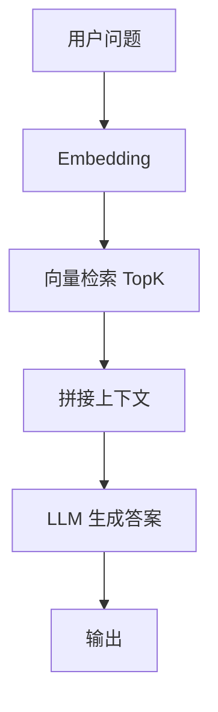
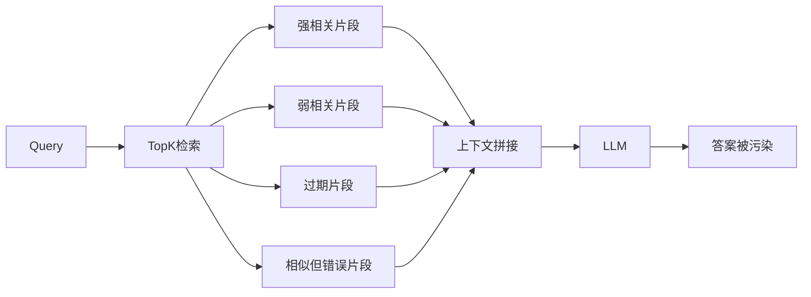
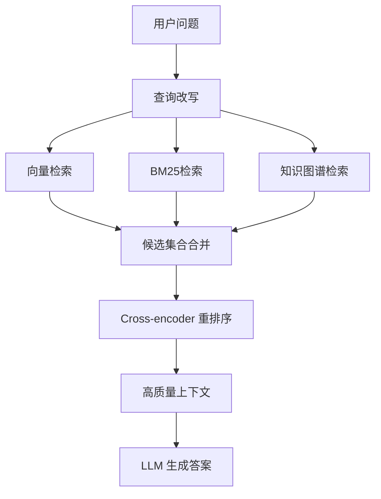
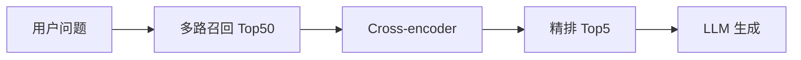
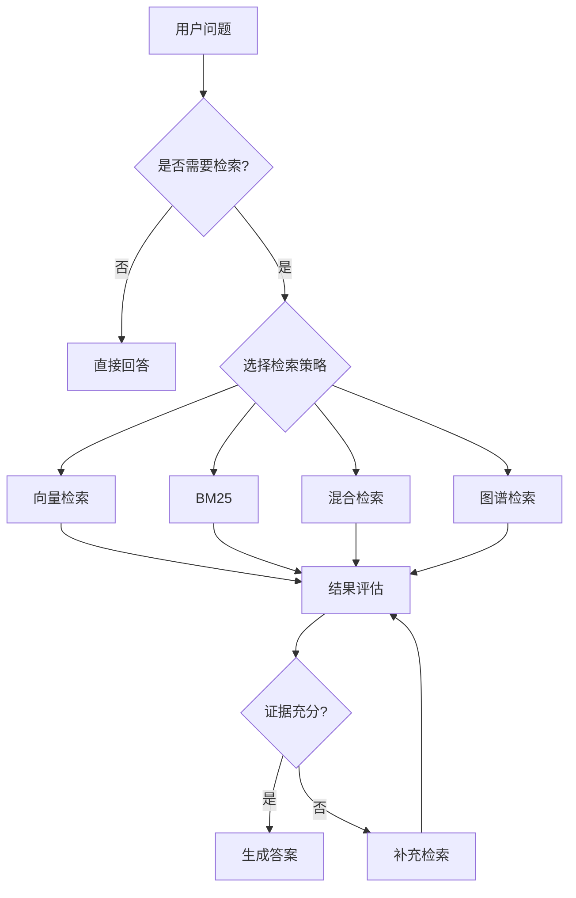
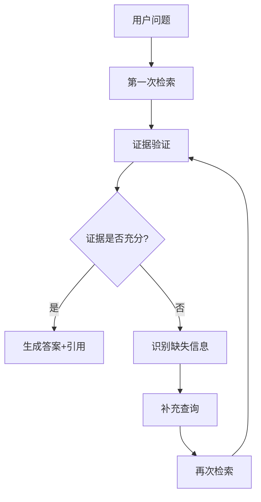

# 第 8 章：高级 RAG — 从检索到推理

# 第八章 高级 RAG——从检索到推理

RAG（Retrieval-Augmented Generation，检索增强生成）已经成为构建企业知识问答、文档助手、代码助手、客服机器人时最常见的技术范式之一。  
它的核心思想并不复杂：**先从外部知识库中检索相关内容，再把检索结果连同用户问题一起交给大模型生成答案**。

朴素 RAG 很容易做出一个“能跑”的版本，但要做出一个**稳定、可信、可上线**的系统，难点才刚刚开始。很多团队在第一版上线后都会遇到类似问题：

- 明明知识库里有答案，系统却答不出来
- 检索到了很多片段，但真正有用的内容很少
- 上下文塞得太多，模型反而更容易胡说
- 不同类型的问题，对检索策略的要求完全不同
- 用户追问时，系统无法判断是否需要继续检索

这也是为什么“高级 RAG”正在成为 AI Agent 工程中的核心能力：  
**RAG 不再只是“查一下再回答”，而是逐步演化成一个带有判断、验证、补充和推理能力的动态系统。**

本章从朴素 RAG 的缺陷开始，逐步引入查询改写、混合检索、重排序、自适应 RAG 与 Agentic RAG，最后用 **Qdrant + Reranker** 搭建一个高质量问答系统，并介绍常见评估指标。

---

## 8.1 朴素 RAG 的问题：噪声、漏召回、上下文污染

先看最常见的朴素 RAG 流程：

```text
用户问题
   │
   ▼
向量化 Query
   │
   ▼
Vector Search TopK
   │
   ▼
拼接上下文
   │
   ▼
LLM 生成答案
```

如果把它画成架构图，可以表示为：



这个流程足够简单，但在真实业务中会遇到三类核心问题。

---

### 8.1.1 噪声：检索到了，但不够相关

向量检索擅长“语义相似”，但语义相似不一定代表**任务相关**。

例如用户问：

> “如何在 Node.js 中处理 OpenAI API 的超时重试？”

向量检索可能会召回：

- 关于 Node.js HTTP 请求的内容
- 关于 OpenAI API 鉴权的内容
- 关于通用“重试机制”的内容
- 关于 Python 中 requests 超时处理的内容

这些内容都“有点像”，但不一定直接回答问题。  
最终结果是：**TopK 中混入大量噪声 chunk**，真正有帮助的信息比例下降。

#### 噪声的根源

1. **向量表示损失**
   - 文本压缩成 embedding 后，不可能完整保留全部语义
2. **chunk 粒度不合适**
   - chunk 太大，主题混杂
   - chunk 太小，语义不完整
3. **TopK 过大**
   - 为了防止漏召回，把 K 调大，结果引入更多低质量内容
4. **查询表达模糊**
   - 用户问题短、歧义大、缺上下文

---

### 8.1.2 漏召回：知识库里有，系统没找到

这比噪声更致命。  
因为只要没召回来，后续生成再聪明也没用。

例如知识库里写的是：

> “指数退避（exponential backoff）适用于 API 调用失败后的重试控制。”

而用户问的是：

> “OpenAI 接口失败后怎么逐步延长等待时间？”

如果只是做一次向量检索，可能因为表达不一致而漏掉相关片段。

#### 漏召回常见原因

- 同义词、近义表达不一致
- 用户问题过短
- 文档中使用专业术语，用户使用口语
- 多跳问题只检索到表层信息
- 关键实体未被正确切分进 chunk

例如用户问：

> “某公司 2023 年海外营收增长背后的主要原因是什么？”

如果文档中“海外营收增长”和“国际市场扩张、渠道合作、汇率收益”分散在不同段落，单次检索很可能无法完整找齐所有支持证据。

---

### 8.1.3 上下文污染：给得越多，答案越差

很多人做 RAG 时的本能是：  
**检索不准，那就多塞一点上下文。**

这通常会带来反效果。

原因有三点：

1. **注意力被分散**
   - 模型需要从更多 token 中筛选信息，容易关注到错误内容
2. **相互冲突的片段同时存在**
   - 特别是在版本迭代频繁的文档中，新旧文档可能都被召回
3. **“看起来相关”的噪声误导模型**
   - 模型会强行综合所有上下文，输出“合理但错误”的答案

如下图所示：



所以，高级 RAG 的目标不是单纯“召回更多”，而是同时优化：

- **Recall**：尽量别漏
- **Precision**：尽量少噪声
- **Grounding**：回答要有依据
- **Adaptivity**：根据问题类型动态调整策略

---

## 8.2 查询改写：HyDE、多查询扩展、Step-back Prompting

查询改写（Query Rewriting）是提升 RAG 效果最划算的一类手段。  
它不改动知识库，只在“用户问题 → 检索 query”之间做增强。

常见思路有三种：

1. **HyDE**：先让模型“假设性回答”，再拿假设回答去检索
2. **多查询扩展**：从一个问题生成多个检索视角
3. **Step-back Prompting**：先抽象成更高层问题，再检索基础原理

---

### 8.2.1 HyDE：Hypothetical Document Embeddings

HyDE 的核心思想是：

> 不直接用用户问题做 embedding，而是先让 LLM 生成一段“可能的答案文档”，再对这段文档做 embedding 检索。

为什么有效？  
因为很多用户问题很短、很口语，而文档库中的内容通常是结构化、书面化的。  
LLM 生成的“假设文档”往往更接近知识库语言风格。

#### 示例

用户问题：

> “怎么避免接口连续失败后把服务打挂？”

HyDE 生成的假设文档可能是：

> “在高并发 API 调用场景下，常见做法包括指数退避重试、熔断、限流、超时控制和幂等设计，以避免服务雪崩。”

这段文字更容易和知识库中的技术文档匹配。

#### TypeScript 实现

下面用 OpenAI 兼容接口演示 HyDE 查询改写：

```ts
// src/retrieval/hyde.ts
import OpenAI from "openai";

const client = new OpenAI({
  apiKey: process.env.OPENAI_API_KEY!,
});

export async function generateHyDE(query: string): Promise<string> {
  const resp = await client.chat.completions.create({
    model: "gpt-4o-mini",
    temperature: 0.2,
    messages: [
      {
        role: "system",
        content: "你是一个检索查询增强助手。请根据用户问题，生成一段可能出现在技术文档中的回答性文本，用于向量检索。不要编造具体事实，不要使用第一人称。",
      },
      {
        role: "user",
        content: `用户问题：${query}`,
      },
    ],
  });

  return resp.choices[0].message.content?.trim() || query;
}
```

---

### 8.2.2 多查询扩展：从多个角度召回

单个 query 往往只覆盖一种表达方式。  
多查询扩展会让模型生成多个等价或互补的检索问题，然后合并结果。

例如问题：

> “为什么我的 RAG 系统总是答非所问？”

可以扩展成：

- RAG 回答不准确的常见原因
- 检索增强生成中的上下文污染问题
- 向量检索噪声对 LLM 回答质量的影响
- 如何改进 RAG 的召回与排序质量

#### 优势

- 提升召回率
- 覆盖专业术语与口语表达差异
- 对复杂问题更友好

#### 风险

- 检索成本上升
- 容易引入更多噪声，需要后续 rerank

#### TypeScript 实现

```ts
// src/retrieval/multiQuery.ts
import OpenAI from "openai";

const client = new OpenAI({
  apiKey: process.env.OPENAI_API_KEY!,
});

export async function expandQueries(query: string, n = 4): Promise<string[]> {
  const resp = await client.chat.completions.create({
    model: "gpt-4o-mini",
    temperature: 0.4,
    messages: [
      {
        role: "system",
        content: `你是一个检索查询扩展助手。
请基于用户问题生成 ${n} 个不同表述但语义相关的检索查询。
要求：
1. 保留原问题意图
2. 覆盖不同术语表达
3. 每行一个查询
4. 不要编号`,
      },
      {
        role: "user",
        content: query,
      },
    ],
  });

  const text = resp.choices[0].message.content || "";
  const queries = text
    .split("\n")
    .map((s) => s.trim())
    .filter(Boolean);

  return Array.from(new Set([query, ...queries]));
}
```

---

### 8.2.3 Step-back Prompting：先抽象，再检索

Step-back Prompting 适合那些**局部问题背后依赖更一般原理**的场景。

例如用户问：

> “为什么使用 cross-encoder 重排序后，RAG 的最终回答更稳定？”

如果直接检索，可能只能找到“cross-encoder 是什么”；  
但如果先退一步抽象成：

> “信息检索中的粗排与精排为什么要分层设计？”

就更容易召回解释本质原因的文档。

#### 适用场景

- 原理解释类问题
- Why 类问题
- 多跳推理问题
- 架构设计类问题

#### 实现示例

```ts
// src/retrieval/stepBack.ts
import OpenAI from "openai";

const client = new OpenAI({
  apiKey: process.env.OPENAI_API_KEY!,
});

export async function stepBackQuery(query: string): Promise<string> {
  const resp = await client.chat.completions.create({
    model: "gpt-4o-mini",
    temperature: 0.3,
    messages: [
      {
        role: "system",
        content: `请将用户问题抽象成一个更高层、更基础原理导向的检索问题。
要求：
1. 不改变核心意图
2. 更关注原理、机制、通用方法
3. 输出一句话`,
      },
      {
        role: "user",
        content: query,
      },
    ],
  });

  return resp.choices[0].message.content?.trim() || query;
}
```

---

### 8.2.4 查询改写策略对比

| 方法 | 核心思想 | 优点 | 缺点 | 适用场景 |
|---|---|---|---|---|
| 原始 Query | 直接检索 | 成本低 | 容易漏召回 | 简单事实问答 |
| HyDE | 生成假设文档再检索 | 适合短 query、口语 query | 依赖 LLM，可能引入偏差 | 技术问答、企业知识库 |
| 多查询扩展 | 多个 query 并行召回 | 提高 recall | 成本增加、噪声变多 | 复杂问题、术语多样场景 |
| Step-back | 退一步检索原理层知识 | 适合 Why 类问题 | 不适合纯实体查询 | 架构、机制、分析类问题 |

---

## 8.3 混合检索：向量 + BM25 + 知识图谱

只靠向量检索并不足够。  
在生产环境中，效果更稳定的方案通常是**混合检索（Hybrid Retrieval）**。

---

### 8.3.1 为什么要混合检索

向量检索擅长语义相似，但对以下内容并不总是可靠：

- 精确术语
- 错误码
- API 名称
- 类名、函数名、参数名
- 日期、版本号
- 实体关系

例如用户问：

> “`response_format` 参数在 SDK v4 中如何使用？”

这类问题里：

- `response_format`
- SDK v4

都属于高精度关键词，BM25 往往更有优势。

而如果问题是：

> “如何让生成结果更可控、结构化？”

向量检索更容易找到相关内容。

因此最稳妥的做法是：

- **向量检索负责语义召回**
- **BM25 负责关键词精确召回**
- **知识图谱负责实体与关系推理**

---

### 8.3.2 混合检索架构图



相较于朴素 RAG，这个架构最大的变化是：

1. 查询阶段不再只有一个 query
2. 检索阶段不再只有一个 retriever
3. 生成前增加 rerank
4. 可根据问题类型动态调整策略

---

### 8.3.3 BM25 的作用

BM25 是经典稀疏检索算法，本质上基于词频、逆文档频率和文档长度做评分。  
它对“关键词命中”非常敏感。

#### BM25 特别擅长的场景

- 报错信息定位
- 日志检索
- API 参数说明
- SQL 字段、表名
- 法律条文编号
- 产品型号、版本号

#### Python 辅助示例：本地 BM25 检索

```python
# bm25_demo.py
from rank_bm25 import BM25Okapi

docs = [
    "OpenAI SDK v4 supports response_format for structured output.",
    "Use exponential backoff to handle API retry.",
    "Qdrant is a vector database for semantic search."
]

tokenized = [doc.lower().split() for doc in docs]
bm25 = BM25Okapi(tokenized)

query = "how to use response_format in sdk v4"
scores = bm25.get_scores(query.lower().split())

for doc, score in zip(docs, scores):
    print(score, doc)
```

---

### 8.3.4 知识图谱检索的作用

知识图谱（KG）不是 RAG 的必须组件，但在以下场景非常有价值：

- 问题涉及明确实体关系
- 需要做多跳推理
- 文档描述分散，纯文本检索难聚合
- 需要可解释的路径

例如企业内部知识库中有：

- 服务 A 依赖服务 B
- 服务 B 使用数据库 C
- 数据库 C 部署在可用区 D

如果用户问：

> “服务 A 为什么受到可用区 D 故障影响？”

向量检索只能找到局部片段，而知识图谱可以沿着依赖路径做链路分析。

#### 一个简单 KG 检索思路

1. 从 query 中抽取实体
2. 在图数据库或关系表中查实体邻居
3. 获取一跳/两跳相关节点描述
4. 把路径证据作为上下文输入模型

---

### 8.3.5 混合检索结果融合

常见融合方式有两类：

#### 1. 分数归一化后加权

```text
final_score = 0.5 * vector_score + 0.3 * bm25_score + 0.2 * graph_score
```

优点：简单直观  
缺点：不同检索器分数尺度不一致，调参麻烦

#### 2. Reciprocal Rank Fusion（RRF）

RRF 更常用，也更稳健：

```text
RRF(d) = Σ 1 / (k + rank_i(d))
```

一个文档只要在多个检索器中都排名靠前，最终分数就会更高。

#### TypeScript 实现 RRF

```ts
// src/retrieval/rrf.ts
export interface RankedDoc {
  id: string;
  text: string;
  source: string;
  rank: number;
}

export function reciprocalRankFusion(
  lists: RankedDoc[][],
  k = 60
): Array<RankedDoc & { score: number }> {
  const scoreMap = new Map<string, RankedDoc & { score: number }>();

  for (const list of lists) {
    for (const item of list) {
      const prev = scoreMap.get(item.id);
      const inc = 1 / (k + item.rank);
      if (prev) {
        prev.score += inc;
      } else {
        scoreMap.set(item.id, { ...item, score: inc });
      }
    }
  }

  return Array.from(scoreMap.values()).sort((a, b) => b.score - a.score);
}
```

---

## 8.4 Re-ranking：Cross-encoder 重排序

混合检索解决的是“召回更多候选”，但候选集合里仍然可能有噪声。  
这时候需要 **Re-ranking**。

---

### 8.4.1 为什么需要重排序

向量检索常常使用双塔结构（bi-encoder）：

- query 编码一次
- document 编码一次
- 通过向量相似度计算得分

优点是快，适合大规模召回。  
缺点是 query 和 doc 独立编码，无法细粒度比对。

Cross-encoder 不一样：  
它把 **query 和 document 一起输入模型**，直接输出相关性分数。

因此：

- **Bi-encoder 适合召回**
- **Cross-encoder 适合精排**

这是典型的“粗排 + 精排”两阶段架构。

---

### 8.4.2 Cross-encoder 的优势

对于问题：

> “如何在 RAG 中降低上下文污染？”

Cross-encoder 可以更好地区分：

- 真正讲“上下文污染”的段落
- 只是提到“上下文窗口”的段落
- 泛泛讨论“检索效果”的段落

因为它在打分时看到的是 query-doc 配对，而不是两个独立 embedding。

---

### 8.4.3 重排序流程图



---

### 8.4.4 Python 辅助示例：Cross-encoder 重排序

很多开源 reranker 都可以直接使用，例如 `sentence-transformers` 中的 cross-encoder：

```python
# rerank_demo.py
from sentence_transformers import CrossEncoder

model = CrossEncoder("cross-encoder/ms-marco-MiniLM-L-6-v2")

query = "How to reduce context pollution in RAG?"
docs = [
    "Context pollution happens when too many irrelevant chunks are inserted into prompts.",
    "Qdrant is a vector database.",
    "Prompt length affects latency and cost."
]

pairs = [[query, doc] for doc in docs]
scores = model.predict(pairs)

ranked = sorted(zip(docs, scores), key=lambda x: x[1], reverse=True)
for doc, score in ranked:
    print(score, doc)
```

---

### 8.4.5 在工程中如何选择 TopK

一个常见配置：

- 初始召回：Top 30 ~ 100
- 重排序后保留：Top 3 ~ 8
- 最终送入 LLM：按 token 预算控制

实践经验：

- **召回 TopK 太小**：容易漏掉正确信息
- **召回 TopK 太大**：rerank 成本上升
- **最终上下文太长**：生成质量反而下降

通常可以采用：

- 先多召回
- 再重排序
- 最后做上下文压缩/裁剪

---

## 8.5 自适应 RAG：Agent 决定何时检索、检索什么

朴素 RAG 的隐含假设是：**每个问题都要检索，而且检索方式相同。**

这在真实环境里并不合理。

例如：

- “你是谁？” —— 不需要检索
- “总结这段对话” —— 只需要会话记忆
- “公司 2024 年差旅报销标准是什么？” —— 需要知识库检索
- “先比较 A 方案和 B 方案，再查最新预算限制” —— 需要先推理再检索

所以更先进的做法是：  
让 Agent 在回答前先判断：

1. 是否需要检索
2. 该检索哪个知识源
3. 用哪种查询策略
4. 检索一次够不够

---

### 8.5.1 自适应 RAG 决策流程



---

### 8.5.2 用 LLM 做路由判断

我们可以先让模型输出一个结构化决策：

- need_retrieval: boolean
- source: `vector | bm25 | hybrid | graph`
- rewrite_strategy: `none | hyde | multi_query | step_back`
- reason: string

#### TypeScript 示例

```ts
// src/agent/router.ts
import OpenAI from "openai";

const client = new OpenAI({
  apiKey: process.env.OPENAI_API_KEY!,
});

export type RetrievalPlan = {
  needRetrieval: boolean;
  source: "vector" | "bm25" | "hybrid" | "graph" | "none";
  rewriteStrategy: "none" | "hyde" | "multi_query" | "step_back";
  reason: string;
};

export async function planRetrieval(query: string): Promise<RetrievalPlan> {
  const resp = await client.chat.completions.create({
    model: "gpt-4o-mini",
    temperature: 0,
    response_format: { type: "json_object" },
    messages: [
      {
        role: "system",
        content: `你是一个 RAG 路由器。请判断用户问题是否需要检索，并输出 JSON：
{
  "needRetrieval": boolean,
  "source": "vector" | "bm25" | "hybrid" | "graph" | "none",
  "rewriteStrategy": "none" | "hyde" | "multi_query" | "step_back",
  "reason": "string"
}`,
      },
      {
        role: "user",
        content: query,
      },
    ],
  });

  return JSON.parse(resp.choices[0].message.content || "{}");
}
```

---

## 8.6 Agentic RAG：检索→验证→补充→再检索的循环

自适应 RAG 已经开始具备“决策能力”，但 Agentic RAG 更进一步：  
**它不把检索当作一次性动作，而是一个带反馈闭环的过程。**

核心思想是：

1. 先检索
2. 判断证据是否足够
3. 如果不足，提出缺失点
4. 继续补充检索
5. 直到可以回答，或达到终止条件

这非常适合：

- 多跳问答
- 证据分散问题
- 高风险问答
- 需要引用依据的问题

---

### 8.6.1 Agentic RAG 循环架构



---

### 8.6.2 “验证”到底在验证什么

至少要验证三件事：

1. **相关性**
   - 这些文档是否真的回答用户问题
2. **充分性**
   - 是否具备完整证据，而不是只覆盖一部分
3. **一致性**
   - 不同证据之间是否冲突

例如问题：

> “为什么公司 A 在 2023 年利润提升，但现金流下降？”

这类问题通常需要：

- 利润数据
- 现金流数据
- 管理层解释
- 可能的非现金收益、应收账款变化等信息

只检索到利润上涨，不足以回答整个问题。  
Agentic RAG 会在验证阶段发现“现金流成因证据缺失”，然后发起第二轮检索。

---

### 8.6.3 一个简化的 Agentic RAG 状态机

```ts
// src/agent/agenticRag.ts
export type RagState = {
  question: string;
  retrieved: string[];
  missingInfo: string[];
  answer?: string;
  done: boolean;
  iteration: number;
};

export function shouldContinue(state: RagState, maxIterations = 3): boolean {
  return !state.done && state.iteration < maxIterations;
}
```

当然，真正的核心不在状态定义，而在“证据评估器”。

---

### 8.6.4 用 LLM 判断证据是否充分

```ts
// src/agent/evaluator.ts
import OpenAI from "openai";

const client = new OpenAI({
  apiKey: process.env.OPENAI_API_KEY!,
});

export async function evaluateEvidence(
  question: string,
  contexts: string[]
): Promise<{ sufficient: boolean; missingInfo: string[]; reason: string }> {
  const joined = contexts.map((c, i) => `【证据${i + 1}】\n${c}`).join("\n\n");

  const resp = await client.chat.completions.create({
    model: "gpt-4o-mini",
    temperature: 0,
    response_format: { type: "json_object" },
    messages: [
      {
        role: "system",
        content: `你是一个证据充分性评估器。判断给定证据是否足以回答问题。
输出 JSON:
{
  "sufficient": boolean,
  "missingInfo": ["string"],
  "reason": "string"
}`,
      },
      {
        role: "user",
        content: `问题：${question}\n\n证据：\n${joined}`,
      },
    ],
  });

  return JSON.parse(resp.choices[0].message.content || "{}");
}
```

这一步本质上把 RAG 从“单次检索+生成”升级成“**检索驱动的推理循环**”。

---

## 8.7 实战：用 Qdrant + Reranker 实现一个高质量问答系统

下面实现一个可运行的高质量 RAG 问答系统，技术栈如下：

- **TypeScript / Node.js**
- **Qdrant**：向量数据库
- **OpenAI Embedding**：文本向量化
- **Cross-encoder Reranker**：重排序
- **OpenAI Chat Model**：最终回答

为了保持示例可运行，本节将：

1. 用 Qdrant 存储文档 chunk
2. 做基础向量检索
3. 使用多查询扩展增强召回
4. 用 reranker 精排
5. 最后生成带引用的答案

---

### 8.7.1 项目结构

```text
rag-system/
├─ src/
│  ├─ config.ts
│  ├─ ingest.ts
│  ├─ ask.ts
│  ├─ retrieval/
│  │  ├─ embed.ts
│  │  ├─ multiQuery.ts
│  │  ├─ qdrant.ts
│  │  └─ rerank.ts
├─ package.json
├─ tsconfig.json
└─ .env
```

---

### 8.7.2 安装依赖

```bash
npm init -y
npm install openai @qdrant/js-client-rest dotenv
npm install -D typescript ts-node @types/node
```

初始化 TypeScript：

```bash
npx tsc --init
```

---

### 8.7.3 配置文件

```ts
// src/config.ts
import "dotenv/config";

export const config = {
  openaiApiKey: process.env.OPENAI_API_KEY!,
  qdrantUrl: process.env.QDRANT_URL || "http://localhost:6333",
  qdrantApiKey: process.env.QDRANT_API_KEY || "",
  collectionName: process.env.QDRANT_COLLECTION || "docs",
  embeddingModel: process.env.EMBEDDING_MODEL || "text-embedding-3-small",
  chatModel: process.env.CHAT_MODEL || "gpt-4o-mini",
};
```

`.env` 示例：

```env
OPENAI_API_KEY=your_api_key
QDRANT_URL=http://localhost:6333
QDRANT_COLLECTION=docs
```

---

### 8.7.4 封装 Embedding

```ts
// src/retrieval/embed.ts
import OpenAI from "openai";
import { config } from "../config";

const client = new OpenAI({
  apiKey: config.openaiApiKey,
});

export async function embedText(text: string): Promise<number[]> {
  const resp = await client.embeddings.create({
    model: config.embeddingModel,
    input: text,
  });

  return resp.data[0].embedding;
}
```

---

### 8.7.5 Qdrant 客户端封装

```ts
// src/retrieval/qdrant.ts
import { QdrantClient } from "@qdrant/js-client-rest";
import { config } from "../config";

export const qdrant = new QdrantClient({
  url: config.qdrantUrl,
  apiKey: config.qdrantApiKey || undefined,
});

export async function ensureCollection(vectorSize: number) {
  const collections = await qdrant.getCollections();
  const exists = collections.collections.some(
    (c) => c.name === config.collectionName
  );

  if (!exists) {
    await qdrant.createCollection(config.collectionName, {
      vectors: {
        size: vectorSize,
        distance: "Cosine",
      },
    });
  }
}
```

---

### 8.7.6 文档切分与入库

这里为了简化，使用固定大小切分。生产环境建议使用：

- 按标题层级切分
- 语义切分
- 带 overlap 的递归切分

```ts
// src/ingest.ts
import fs from "fs/promises";
import path from "path";
import { ensureCollection, qdrant } from "./retrieval/qdrant";
import { embedText } from "./retrieval/embed";
import { config } from "./config";

type Chunk = {
  id: string;
  text: string;
  source: string;
};

function chunkText(text: string, size = 500, overlap = 100): string[] {
  const chunks: string[] = [];
  let start = 0;
  while (start < text.length) {
    const end = Math.min(start + size, text.length);
    chunks.push(text.slice(start, end));
    start += size - overlap;
  }
  return chunks;
}

async function loadDocs(dir: string): Promise<Chunk[]> {
  const files = await fs.readdir(dir);
  const chunks: Chunk[] = [];

  for (const file of files) {
    const fullPath = path.join(dir, file);
    const stat = await fs.stat(fullPath);
    if (!stat.isFile()) continue;

    const content = await fs.readFile(fullPath, "utf-8");
    const parts = chunkText(content);

    parts.forEach((text, idx) => {
      chunks.push({
        id: `${file}-${idx}`,
        text,
        source: file,
      });
    });
  }

  return chunks;
}

async function main() {
  const chunks = await loadDocs("./knowledge");
  if (chunks.length === 0) {
    throw new Error("No documents found in ./knowledge");
  }

  const firstVec = await embedText(chunks[0].text);
  await ensureCollection(firstVec.length);

  const points = [];
  for (const chunk of chunks) {
    const vector = await embedText(chunk.text);
    points.push({
      id: chunk.id,
      vector,
      payload: {
        text: chunk.text,
        source: chunk.source,
      },
    });
  }

  await qdrant.upsert(config.collectionName, {
    wait: true,
    points,
  });

  console.log(`Ingested ${points.length} chunks.`);
}

main().catch(console.error);
```

---

### 8.7.7 向量检索 + 多查询扩展

```ts
// src/retrieval/search.ts
import { qdrant } from "./qdrant";
import { config } from "../config";
import { embedText } from "./embed";
import { expandQueries } from "./multiQuery";

export type RetrievedDoc = {
  id: string;
  text: string;
  source: string;
  score: number;
};

export async function searchQdrant(
  query: string,
  limit = 8
): Promise<RetrievedDoc[]> {
  const vector = await embedText(query);
  const result = await qdrant.search(config.collectionName, {
    vector,
    limit,
    with_payload: true,
  });

  return result.map((item: any) => ({
    id: String(item.id),
    text: item.payload.text,
    source: item.payload.source,
    score: item.score,
  }));
}

export async function multiSearch(query: string): Promise<RetrievedDoc[]> {
  const queries = await expandQueries(query, 3);
  const all: RetrievedDoc[] = [];

  for (const q of queries) {
    const docs = await searchQdrant(q, 5);
    all.push(...docs);
  }

  const dedup = new Map<string, RetrievedDoc>();
  for (const doc of all) {
    const prev = dedup.get(doc.id);
    if (!prev
