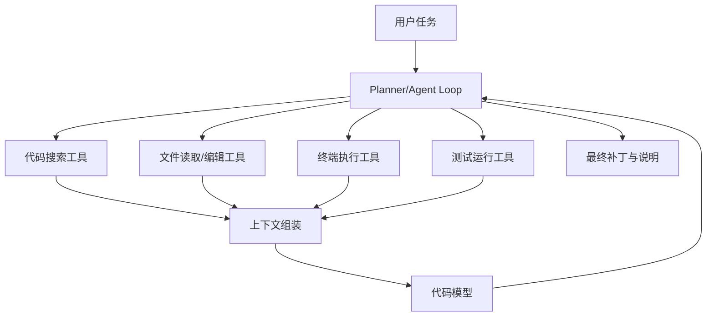
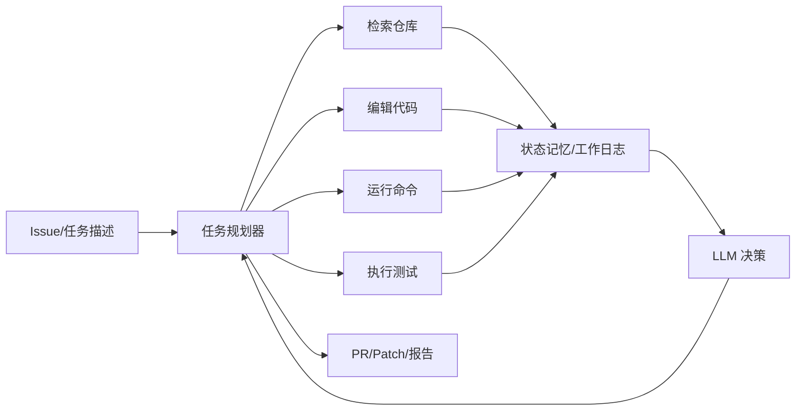

# 第 9 章：代码 Agent — 让 AI 写代码改代码

# 第九章 代码 Agent —— 让 AI 写代码、改代码

代码生成并不新鲜，真正困难的是：**让 AI 在真实代码库里稳定地“理解—修改—验证—提交结果”**。  
从聊天式补全，到能在仓库里自主搜索、编辑、运行测试、修复错误的代码 Agent，核心变化不是模型会不会写代码，而是系统是否具备**工程闭环能力**。

这一章我们聚焦代码 Agent 的设计与实现：它为什么比普通问答 Agent 难，Claude Code、Cursor、Devin 这类系统在架构上做了哪些关键取舍，以及如何亲手实现一个能够**读代码、改代码、跑测试**的 Mini Agent。

---

## 9.1 为什么代码 Agent 比普通 Agent 更难

一个问答 Agent 回答错了，最多是信息不准确；一个代码 Agent 改错一行代码，可能会让整个系统无法编译，甚至引入线上事故。  
因此，代码 Agent 的设计目标不是“看起来聪明”，而是：

- **尽可能少犯错**
- **犯错后能自我验证并修复**
- **在复杂仓库中保持上下文一致**
- **在受控环境中执行，避免破坏宿主机**

代码 Agent 的特殊挑战主要体现在三个方面。

---

## 9.2 代码 Agent 的特殊挑战

### 9.2.1 正确性验证：不是“像对”，而是“真的对”

自然语言任务常常允许模糊答案，但代码不行。  
代码 Agent 的输出必须经过某种形式的验证，否则“看起来合理”的修改极易变成隐患。

常见验证手段包括：

| 验证方式 | 说明 | 适用场景 |
|---|---|---|
| 语法检查 | TypeScript 编译、Python 语法检查 | 最基础 |
| 静态分析 | ESLint、mypy、ruff、tsc | 发现明显错误 |
| 单元测试 | 验证局部行为 | 修复函数、模块改动 |
| 集成测试 | 验证系统交互 | 服务级改动 |
| 端到端测试 | 验证业务流程 | UI/接口联动 |
| 差异检查 | 只验证受影响区域 | 大仓库提效 |
| 人工 review | 最终风险兜底 | 生产发布前 |

代码 Agent 必须具备一个关键理念：

> **生成不是终点，验证才是工作流的一部分。**

这也是为什么成熟代码 Agent 不只是“返回代码片段”，而是会主动：
1. 搜索相关文件
2. 理解调用链
3. 修改代码
4. 运行测试
5. 根据报错继续修复
6. 输出最终 patch 与说明

这已经接近一个初级工程师处理 issue 的方式了。

---

### 9.2.2 大仓库理解：问题不在“写函数”，而在“找到该改哪儿”

很多演示里的代码 Agent 都是在几十行样例代码上操作。但真实项目往往是：

- 几百到几千个文件
- 多语言混合：TypeScript + Python + YAML + SQL
- 历史代码风格不统一
- 有大量自动生成文件、依赖目录、构建产物
- 模块间依赖复杂，改一处影响多处

Agent 面对的第一难题往往不是“怎么写”，而是：

- 入口文件在哪里？
- 哪个模块负责这个功能？
- 测试文件在哪？
- 配置项在哪里定义？
- 这个函数被谁调用？
- 是改业务代码还是改适配层？
- 这个 bug 是逻辑问题还是数据契约问题？

如果没有良好的仓库索引与上下文工程，模型只能靠“猜”。

---

### 9.2.3 上下文管理：LLM 看不下整个仓库

即便今天模型的上下文窗口已经大幅增长，直接把一个 10 万行代码库塞进去依然不可行，原因包括：

- 成本高
- 延迟大
- 容易把无关信息一起喂给模型
- 模型会被长上下文噪声干扰
- 修改过程需要动态更新上下文

因此代码 Agent 必须解决：

1. **如何只拿最相关的代码片段**
2. **如何维护任务过程中的“工作记忆”**
3. **如何在修改后更新上下文**
4. **如何避免同一个文件重复读取**
5. **如何记录“已知事实”，减少模型反复推理**

这就是“上下文工程”在代码 Agent 中的核心价值。

---

## 9.3 经典架构：Claude Code / Cursor / Devin 的设计思路

不同产品实现细节不同，但总体思路高度一致：  
**让大模型不直接“盲写代码”，而是通过一组工程工具在仓库中工作。**

---

## 9.4 Claude Code 的典型思路：以终端为中心的代理循环

Claude Code 一类工具的关键设计思想是：

- 把模型放在一个**可操作终端的环境**中
- 模型通过工具调用执行：
  - 搜索文件
  - 查看文件
  - 编辑文件
  - 运行命令
  - 执行测试
- 系统持续将命令输出和文件 diff 回传给模型
- 模型根据反馈迭代直到完成任务

它更像一个“会用 shell 的工程师”。

### 特点

- **强动作能力**：会主动使用 grep、find、cat、git、npm test 等
- **反馈闭环清晰**：失败后能依据终端输出再修
- **适合复杂仓库**：终端天然适配各种语言和工具链
- **高风险高收益**：如果没有沙箱，命令执行的安全风险也最大

可以把它抽象成如下架构：



---

## 9.5 Cursor 的典型思路：编辑器内协作

Cursor 代表的是另一种形态：**把 Agent 能力深度嵌入 IDE**。

### 它的关键设计点

- 利用 IDE 已有能力：
  - 当前打开文件
  - 选中区域
  - 符号索引
  - 语言服务器（LSP）
  - Git diff
- Agent 不总是“完全自主”，而是与开发者协同：
  - 解释代码
  - 生成修改建议
  - 批量编辑多文件
  - 基于当前上下文回答问题
- 更强调**局部高质量修改**和**交互效率**

### 优势

- 上下文更精准：知道你正在看什么代码
- 人在回路中：更容易及时纠错
- 集成现有开发体验：接受成本低

### 局限

- 自主性通常弱于“终端型 Agent”
- 对复杂任务，仍需借助外部命令或完整 Agent loop

---

## 9.6 Devin 的典型思路：任务型软件工程 Agent

Devin 更接近“端到端完成软件任务”的定位。  
它不是仅做代码补全，也不是只在 IDE 协助，而是试图承担完整任务流：

- 阅读 issue
- 理解仓库
- 做计划
- 修改代码
- 运行测试
- 查文档
- 修 bug
- 产出结果

### 设计理念

Devin 类系统通常包含多个子模块：

- **任务规划器**：拆分步骤
- **执行器**：调用搜索、编辑、终端、浏览器等工具
- **记忆系统**：记录已知事实、失败尝试、关键路径
- **验证器**：运行测试、检查构建
- **恢复机制**：失败后回滚、重试、换方案

可以抽象为：



### 本质区别

Claude Code 偏“会用终端的代理”；  
Cursor 偏“IDE 协作式代码助手”；  
Devin 偏“任务导向的软件工程代理”。

三者并不冲突，而是不同产品形态下的重点不同。

---

## 9.7 代码 Agent 的核心能力

一个能工作的代码 Agent，至少要有四类能力：

1. **代码搜索**
2. **文件编辑**
3. **终端执行**
4. **测试运行**

下面逐项展开。

---

### 9.7.1 代码搜索：先找到，再理解

搜索工具是代码 Agent 的眼睛。  
它至少应该支持：

- 按文件名搜索
- 按关键词搜索
- 按正则搜索
- 查看目录树
- 查找符号定义
- 查找引用关系

最简单的实现可以直接封装命令行工具：

- `find`
- `grep` / `ripgrep`
- `git grep`

在 TypeScript 中，我们可以封装一个基础搜索工具。

```ts
// src/tools/search.ts
import { execa } from "execa";

export async function grepCode(
  cwd: string,
  pattern: string,
  glob?: string
): Promise<string> {
  const args = ["-n", "-r", "--exclude-dir=node_modules", "--exclude-dir=.git", pattern, "."];
  if (glob) {
    args.unshift(`--include=${glob}`);
  }

  const { stdout } = await execa("grep", args, { cwd });
  return stdout;
}

export async function findFiles(cwd: string, keyword: string): Promise<string[]> {
  const { stdout } = await execa("find", [".", "-type", "f"], { cwd });
  return stdout
    .split("\n")
    .filter(Boolean)
    .filter((f) => f.toLowerCase().includes(keyword.toLowerCase()));
}
```

如果宿主环境中有 `rg`（ripgrep），性能会更好：

```ts
// src/tools/rg.ts
import { execa } from "execa";

export async function rgSearch(cwd: string, query: string): Promise<string> {
  const { stdout } = await execa(
    "rg",
    [
      "--line-number",
      "--hidden",
      "--glob=!node_modules",
      "--glob=!.git",
      query,
      ".",
    ],
    { cwd }
  );
  return stdout;
}
```

---

### 9.7.2 文件编辑：修改必须可控、可回滚

代码 Agent 不能直接“自由输出整份文件”然后覆盖，这样风险很高。  
更稳妥的做法包括：

- 小范围替换
- 基于 patch/diff 的修改
- 保留原文件备份
- 限制可编辑路径
- 输出修改前后差异

一个简化但可运行的文件编辑器如下。

```ts
// src/tools/fs.ts
import fs from "node:fs/promises";
import path from "node:path";

export async function readFileSafe(root: string, filePath: string): Promise<string> {
  const abs = path.resolve(root, filePath);
  ensureUnderRoot(root, abs);
  return fs.readFile(abs, "utf-8");
}

export async function writeFileSafe(root: string, filePath: string, content: string): Promise<void> {
  const abs = path.resolve(root, filePath);
  ensureUnderRoot(root, abs);
  await fs.writeFile(abs, content, "utf-8");
}

export async function replaceInFile(
  root: string,
  filePath: string,
  oldText: string,
  newText: string
): Promise<boolean> {
  const content = await readFileSafe(root, filePath);
  if (!content.includes(oldText)) return false;
  const updated = content.replace(oldText, newText);
  await writeFileSafe(root, filePath, updated);
  return true;
}

function ensureUnderRoot(root: string, abs: string) {
  const normalizedRoot = path.resolve(root);
  if (!abs.startsWith(normalizedRoot)) {
    throw new Error(`Path escape detected: ${abs}`);
  }
}
```

---

### 9.7.3 终端执行：代码世界的通用工具接口

终端是最强的统一抽象层。  
只要能安全执行命令，Agent 就能接入各种语言生态：

- Node.js：`npm test`, `pnpm build`, `tsc`
- Python：`pytest`, `ruff`, `mypy`
- Go：`go test`
- Rust：`cargo test`

封装一个可控的终端执行器：

```ts
// src/tools/shell.ts
import { execa } from "execa";

export interface CommandResult {
  code: number;
  stdout: string;
  stderr: string;
}

export async function runCommand(
  cwd: string,
  command: string,
  args: string[],
  timeout = 60_000
): Promise<CommandResult> {
  try {
    const result = await execa(command, args, {
      cwd,
      timeout,
      reject: false,
      env: {
        CI: "1",
      },
    });

    return {
      code: result.exitCode ?? 0,
      stdout: result.stdout,
      stderr: result.stderr,
    };
  } catch (err: any) {
    return {
      code: -1,
      stdout: "",
      stderr: err.message || String(err),
    };
  }
}
```

终端执行器需要特别注意：

- 限制超时时间
- 限制工作目录
- 过滤危险命令
- 不继承敏感环境变量
- 禁止网络或只允许白名单网络

---

### 9.7.4 测试运行：把测试作为 Agent 的反馈通道

测试对代码 Agent 的意义，不只是“最后验收”，而是**持续反馈**。  
例如：

- 修改前先跑测试，了解基线
- 修改后跑相关测试
- 若失败，提取错误堆栈喂回模型
- 模型基于错误信息继续修复

一个简单的测试执行封装：

```ts
// src/tools/test.ts
import { runCommand } from "./shell";

export async function runNpmTest(cwd: string) {
  return runCommand(cwd, "npm", ["test", "--", "--runInBand"], 120_000);
}

export async function runJestFile(cwd: string, file: string) {
  return runCommand(cwd, "npx", ["jest", file, "--runInBand"], 120_000);
}

export async function runTypeCheck(cwd: string) {
  return runCommand(cwd, "npx", ["tsc", "--noEmit"], 120_000);
}
```

---

## 9.8 上下文工程：如何让 Agent 理解 10 万行代码库

代码 Agent 的胜负，很多时候不在模型参数，而在上下文组织质量。  
如果你给模型的是一堆无关代码，它会“聪明地胡说”；  
如果你给的是精准、结构化、可追溯的上下文，即便是中等模型也能表现稳定。

下面是实践中最常用的几种方法。

---

### 9.8.1 分层上下文：不要一次性塞满

可以把上下文拆成四层：

| 层级 | 内容 | 用途 |
|---|---|---|
| 任务层 | 用户需求、验收标准、错误信息 | 决策目标 |
| 仓库层 | 项目结构、技术栈、关键入口 | 建立整体理解 |
| 文件层 | 目标文件、相关调用链、测试文件 | 精准修改 |
| 运行层 | 编译输出、测试失败日志、diff | 闭环修复 |

LLM 每一步都不需要全部信息，只需要当前决策所需的最小上下文。

---

### 9.8.2 先索引，再检索

对于大仓库，推荐预先生成轻量级索引：

- 文件列表
- 目录结构摘要
- 关键符号表
- README / package.json / pyproject.toml 摘要
- 测试文件映射
- 依赖关系摘要

例如可以先扫描仓库，生成一个元数据索引。

```ts
// src/indexer.ts
import fs from "node:fs/promises";
import path from "node:path";

export interface FileMeta {
  path: string;
  size: number;
}

export async function walkRepo(root: string): Promise<FileMeta[]> {
  const result: FileMeta[] = [];

  async function walk(dir: string) {
    const entries = await fs.readdir(dir, { withFileTypes: true });
    for (const entry of entries) {
      if (["node_modules", ".git", "dist", "build", ".next"].includes(entry.name)) {
        continue;
      }
      const abs = path.join(dir, entry.name);
      if (entry.isDirectory()) {
        await walk(abs);
      } else {
        const stat = await fs.stat(abs);
        result.push({
          path: path.relative(root, abs),
          size: stat.size,
        });
      }
    }
  }

  await walk(root);
  return result;
}
```

---

### 9.8.3 代码摘要而不是全量代码

一个高性价比策略是：  
**不是把所有文件内容都存起来，而是为每个重要文件生成摘要。**

摘要可包含：

- 文件职责
- 导出的函数/类
- 依赖的核心模块
- 关键配置项
- 测试覆盖情况

这样在搜索到候选文件后，先把摘要给模型，让模型决定是否需要读取全文。

---

### 9.8.4 工作记忆：记录“已经知道什么”

代码 Agent 在多轮执行中，很容易反复读取同样的文件、重复推理同一个结论。  
因此需要一个“工作记忆”结构，例如：

```ts
// src/memory.ts
export interface WorkingMemory {
  task: string;
  assumptions: string[];
  touchedFiles: string[];
  findings: string[];
  testFailures: string[];
}

export function createMemory(task: string): WorkingMemory {
  return {
    task,
    assumptions: [],
    touchedFiles: [],
    findings: [],
    testFailures: [],
  };
}
```

工作记忆中可存储：

- 已定位的入口文件
- 哪些文件已阅读
- 哪些修改已尝试
- 测试为何失败
- 当前最可能的修复方案

模型每轮不必重新理解全部历史，只要看这份浓缩后的工作记忆即可。

---

### 9.8.5 检索策略：关键词 + 结构 + 失败日志

代码问题定位通常不能只靠语义检索。  
最有效的往往是组合检索：

1. **基于 issue 关键词搜索**
2. **基于错误堆栈中的文件/函数名搜索**
3. **基于测试名查找对应实现**
4. **基于导入路径回溯调用链**
5. **基于 Git diff 缩小影响范围**

例如用户说：“修复 parseUser 在 email 缺失时抛错的问题”，可以先搜：

- `parseUser`
- `email`
- 相关测试名
- 错误日志中的行号

这种混合搜索比单纯 embedding 检索更可靠。

---

## 9.9 沙箱安全：Docker、gVisor、Firecracker

代码 Agent 必须执行代码，而“执行不受信任代码”本身就是高风险操作。  
尤其是在以下场景中：

- 修改的是用户上传的仓库
- 运行测试会执行任意脚本
- 依赖安装脚本可能做危险操作
- 命令执行工具可能被 prompt 注入诱导

因此，**沙箱不是可选项，而是代码 Agent 的基础设施。**

---

## 9.10 三种常见执行环境对比

### 9.10.1 Docker

Docker 是最常见、工程成本最低的方案。

#### 优点
- 易用
- 生态成熟
- 便于挂载代码目录和缓存
- 适合 CI/本地开发

#### 缺点
- 隔离强度有限
- 需要进一步限制 capabilities、网络、文件系统权限

适合：
- 内部研发环境
- 风险可控的自动化任务
- Mini Agent 原型

---

### 9.10.2 gVisor

gVisor 在内核调用层提供额外隔离，安全性高于普通 Docker。

#### 优点
- 比原生容器隔离更强
- 对多租户环境更友好

#### 缺点
- 兼容性和性能可能受影响
- 运维复杂度更高

适合：
- 云端多租户代码执行平台
- 对宿主机保护要求较高的场景

---

### 9.10.3 Firecracker

Firecracker 是轻量级微虚拟机技术，兼顾速度和隔离。

#### 优点
- 隔离接近虚拟机
- 启动速度快
- 非常适合运行短生命周期任务

#### 缺点
- 基础设施复杂
- 开发与调试成本高于 Docker

适合：
- 大规模 SaaS 代码执行平台
- 高安全要求的 Agent 服务

---

## 9.11 执行环境安全清单

无论采用哪种方案，建议至少做到：

- 只读基础镜像
- 工作目录独立挂载
- 限制 CPU / 内存 / 进程数
- 禁止特权模式
- 默认断网或使用白名单网络
- 清理环境变量中的密钥
- 限制命令白名单
- 限制最大输出，避免日志洪泛
- 设置超时与强制终止
- 每次任务后销毁环境

下面给一个安全感更强的 Docker 运行示例：

```bash
docker run --rm \
  --cpus="1.0" \
  --memory="1g" \
  --pids-limit=256 \
  --network=none \
  --read-only \
  -v "$(pwd)/workspace:/workspace" \
  -w /workspace \
  node:20-bookworm \
  bash -lc "npm test"
```

如果需要写入临时文件，可以额外挂载 `/tmp`：

```bash
docker run --rm \
  --cpus="1.0" \
  --memory="1g" \
  --pids-limit=256 \
  --network=none \
  --read-only \
  --tmpfs /tmp:size=256m \
  -v "$(pwd)/workspace:/workspace" \
  -w /workspace \
  node:20-bookworm \
  bash -lc "npm test"
```

---

## 9.12 实战：实现一个能读代码、改代码、跑测试的 Mini Agent

下面我们实现一个简化版代码 Agent。  
它具备以下能力：

- 读取仓库文件
- 搜索相关代码
- 让 LLM 决定修改方案
- 执行替换
- 跑测试
- 根据结果输出最终报告

为了聚焦 Agent 工作流，这里假设你已经有一个可调用的大模型接口。我们使用 OpenAI 兼容风格，实际也可换成其他模型。

---

## 9.13 项目结构

```text
mini-code-agent/
├─ src/
│  ├─ agent.ts
│  ├─ llm.ts
│  ├─ memory.ts
│  ├─ indexer.ts
│  ├─ tools/
│  │  ├─ fs.ts
│  │  ├─ rg.ts
│  │  ├─ shell.ts
│  │  └─ test.ts
│  └─ main.ts
├─ package.json
├─ tsconfig.json
```

---

## 9.14 安装依赖

```bash
npm init -y
npm install execa openai zod dotenv
npm install -D typescript tsx @types/node
npx tsc --init
```

`package.json` 示例：

```json
{
  "name": "mini-code-agent",
  "version": "1.0.0",
  "type": "module",
  "scripts": {
    "dev": "tsx src/main.ts"
  },
  "dependencies": {
    "dotenv": "^16.4.5",
    "execa": "^9.3.0",
    "openai": "^4.56.0",
    "zod": "^3.23.8"
  },
  "devDependencies": {
    "@types/node": "^22.5.4",
    "tsx": "^4.19.1",
    "typescript": "^5.6.2"
  }
}
```

---

## 9.15 LLM 封装

```ts
// src/llm.ts
import "dotenv/config";
import OpenAI from "openai";

const client = new OpenAI({
  apiKey: process.env.OPENAI_API_KEY,
  baseURL: process.env.OPENAI_BASE_URL,
});

export async function askModel(prompt: string): Promise<string> {
  const resp = await client.chat.completions.create({
    model: process.env.OPENAI_MODEL || "gpt-4o-mini",
    temperature: 0.2,
    messages: [
      {
        role: "system",
        content:
          "你是一个代码修复 Agent。你必须基于提供的上下文给出最小修改方案。输出 JSON，不要输出 Markdown。",
      },
      {
        role: "user",
        content: prompt,
      },
    ],
  });

  return resp.choices[0]?.message?.content ?? "";
}
```

---

## 9.16 Agent 决策协议

我们要求模型输出结构化 JSON：

```json
{
  "analysis": "问题分析",
  "targetFile": "src/user.ts",
  "oldText": "旧代码片段",
  "newText": "新代码片段",
  "testCommand": ["npm", "test", "--", "--runInBand"]
}
```

这样比让模型直接生成整文件更稳定。

---

## 9.17 Mini Agent 主逻辑

```ts
// src/agent.ts
import { z } from "zod";
import { askModel } from "./llm.js";
import { rgSearch } from "./tools/rg.js";
import { readFileSafe, replaceInFile } from "./tools/fs.js";
import { runCommand } from "./tools/shell.js";
import { createMemory } from "./memory.js";

const PatchSchema = z.object({
  analysis: z.string(),
  targetFile: z.string(),
  oldText: z.string(),
  newText: z.string(),
  testCommand: z.array(z.string()),
});

export async function runMiniAgent(params: {
  repoPath: string;
  task: string;
}) {
  const memory = createMemory(params.task);

  // 1. 搜索相关代码
  const searchResult = await rgSearch(params.repoPath, extractKeyword(params.task));
  memory.findings.push(`Search result:\n${truncate(searchResult, 4000)}`);

  // 2. 提取候选文件
  const firstMatch = searchResult.split("\n")[0];
  if (!firstMatch) {
    throw new Error("未找到相关代码");
  }

  const targetFile = firstMatch.split(":")[0];
  memory.touchedFiles.push(targetFile);

  // 3. 读取目标文件
  const fileContent = await readFileSafe(params.repoPath, targetFile);

  // 4. 让模型生成最小修改方案
  const prompt = `
任务：
${params.task}

搜索结果：
${truncate(searchResult, 4000)}

目标文件：
${targetFile}

文件内容：
${truncate(fileContent, 12000)}

请输出 JSON，字段：
analysis, targetFile, oldText, newText, testCommand

要求：
1. 只做最小修改
2. oldText 必须是文件中真实存在的连续片段
3. testCommand 必须是数组，如 ["npm","test","--","--runInBand"]
`;

  const raw = await askModel(prompt);
  const json = safeJsonParse(raw);
  const patch = PatchSchema.parse(json);

  // 5. 执行替换
  const replaced = await replaceInFile(
    params.repoPath,
    patch.targetFile,
    patch.oldText,
    patch.newText
  );

  if (!replaced) {
    throw new Error("模型给出的 oldText 未匹配文件内容，拒绝修改");
  }

  // 6. 运行测试
  const [cmd, ...args] = patch.testCommand;
  const testResult = await runCommand(params.repoPath, cmd, args, 120_000);

  return {
    analysis: patch.analysis,
    targetFile: patch.targetFile,
    testResult,
    memory,
  };
}

function extractKeyword(task: string): string {
  const m = task.match(/[A-Za-z_][A-Za-z0-9_]*/g);
  return m?.[0] || task.split(/\s+/)[0];
}

function truncate(text: string, max: number): string {
  return text.length <= max ? text : text.slice(0, max) + "\n...[truncated]";
}

function safeJsonParse(text: string): unknown {
  try {
    return JSON.parse(text);
  } catch {
    const start = text.indexOf("{");
    const end = text.lastIndexOf("}");
    if (start >= 0 && end > start) {
      return JSON.parse(text.slice(start, end + 1));
    }
    throw new Error("模型输出不是合法 JSON");
  }
}
```

---

## 9.18 命令行入口

```ts
// src/main.ts
import { runMiniAgent } from "./agent.js";

async function main() {
  const repoPath = process.argv[2];
  const task = process.argv.slice(3).join(" ");

  if (!repoPath || !task) {
    console.error('Usage: npm run dev -- <repoPath> "<task>"');
    process.exit(1);
  }

  const result = await runMiniAgent({ repoPath, task });

  console.log("=== Analysis ===");
  console.log(result.analysis);

  console.log("\n=== Touched File ===");
  console.log(result.targetFile);

  console.log("\n=== Test Result ===");
  console.log(`Exit Code: ${result.testResult.code}`);
  console.log(result.testResult.stdout);
  console.error(result.testResult.stderr);
}

main().catch((err) => {
  console.error(err);
  process.exit(1);
});
```

---

## 9.19 准备一个示例仓库

比如我们准备一个有 bug 的 TypeScript 项目：

```ts
// demo-repo/src/user.ts
export interface User {
  id: string;
  email?: string;
}

export function parseUser(input: any): User {
  return {
    id: String(input.id),
    email: input.email.toLowerCase(),
  };
}
```

测试文件：

```ts
// demo-repo/src/user.test.ts
import { describe, expect, it } from "@jest/globals";
import { parseUser } from "./user";

describe("parseUser", () => {
  it("should keep email lowercase", () => {
    expect(parseUser({ id: 1, email: "A@B.COM" })).toEqual({
      id: "1",
      email: "a@b.com",
    });
  });

  it("should allow missing email", () => {
    expect(parseUser({ id: 2 })).toEqual({
      id: "2",
      email: undefined,
    });
  });
});
```

用户任务：

```bash
npm run dev -- ./demo-repo "修复 parseUser 在 email 缺失时抛错的问题，并运行测试"
```

模型很可能生成如下替换：

```ts
export function parseUser(input: any): User {
  return {
    id: String(input.id),
    email: input.email ? String(input.email).toLowerCase() : undefined,
  };
}
```

然后 Agent 自动跑测试，得到结果。

---

## 9.20 让 Mini Agent 更像真正的代码 Agent

上面这个版本能工作，但距离生产级还有明显差距。继续增强时，建议加入以下能力。

### 1. 多轮修复循环

如果测试失败，不要立刻结束。应把失败日志回传给模型，再给它一轮修复机会。

```ts
for (let i = 0; i < 3; i++) {
  // 生成 patch -> 应用 patch -> 跑测试
  // 若失败，则将 stderr/stdout 摘要加入下一轮 prompt
}
```

### 2. 多文件修改

真实任务往往涉及：
- 源码文件
- 测试文件
- 配置文件
- 类型定义文件

因此修改协议应从单文件扩展为 patch 列表。

### 3. 使用 AST 编辑而不是纯文本替换

纯文本替换简单，但不够稳。  
对 TypeScript 可以使用：

- `ts-morph`
- Babel parser + generator
- Recast

这样可以在函数级、导入级、对象属性级进行更精确修改。

### 4. 测试选择器

优先执行相关测试，而不是全量测试，提高速度。  
例如基于：
- 修改文件名映射测试文件
- 错误堆栈
- jest test name pattern

### 5. Git diff 输出

修改后自动生成 diff，给用户更清晰的结果说明。

---

## 9.21 一个简单的 Python 辅助脚本：提取失败测试摘要

有时 TypeScript 主流程里处理复杂日志不方便，可以配合 Python 辅助脚本做日志摘要。

```python
# scripts/summarize_test_log.py
import sys

def main():
    text = sys.stdin.read()
    lines = text.splitlines()

    important = []
    for line in lines:
        if "FAIL" in line or "Error" in line or "Expected" in line or "Received" in line:
            important.append(line)

    print("\n".join(important[:50]))

if __name__ == "__main__":
    main()
```

在 Agent 中可以把测试日志通过这个脚本压缩后再喂给模型，减少 token 消耗。

---

## 9.22 评估：SWE-bench、HumanEval 等基准测试解读

做出一个“看起来能改代码”的 Agent 不难，难的是知道它到底好不好。  
这就需要基准测试。

---

## 9.23 HumanEval：偏函数级代码生成

HumanEval 由 OpenAI 提出，主要评估模型根据函数描述生成正确实现的能力。

### 特点

- 问题规模小
- 输入通常是函数签名 + docstring
- 通过单元测试判定正确性
- 常用指标是 `pass@k`

### 适合评估什么

- 代码补全能力
- 局部算法实现能力
- 语法与基础逻辑正确率

### 不适合评估什么

- 仓库级修改
- 多文件依赖
- 测试修复循环
- 工具调用能力

因此 HumanEval 更像“模型会不会写函数”，而不是“Agent 会不会做软件工程”。

---

## 9.24 SWE-bench：更接近真实软件修复

SWE-bench 是目前代码 Agent 领域最重要的基准之一。  
它从真实开源仓库 issue 中构造任务，要求模型或 Agent 生成 patch 来修复问题。

### 它评估的是

- 能否理解 issue 描述
- 能否在真实仓库中定位相关代码
- 能否做出正确修改
- 能否通过项目测试

### 为什么它更重要

因为它接近真实软件工程：

- 大型代码库
- 复杂依赖
- 多文件关系
- 必须运行测试验证
- 需要仓库级理解

### 解读 SWE-bench 成绩时要注意

1
