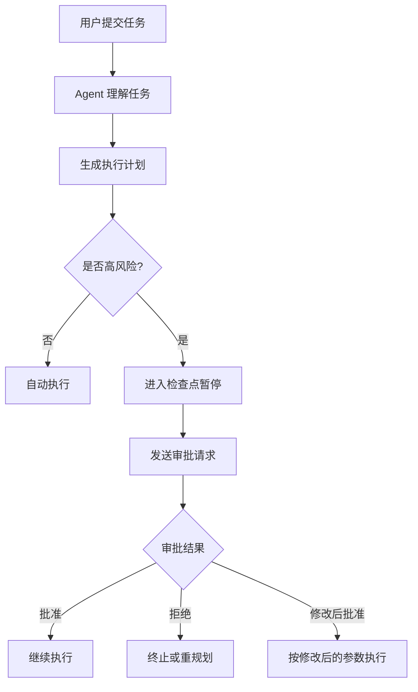
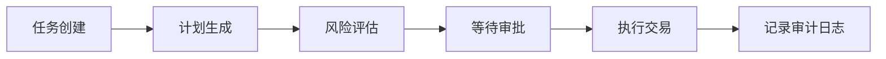
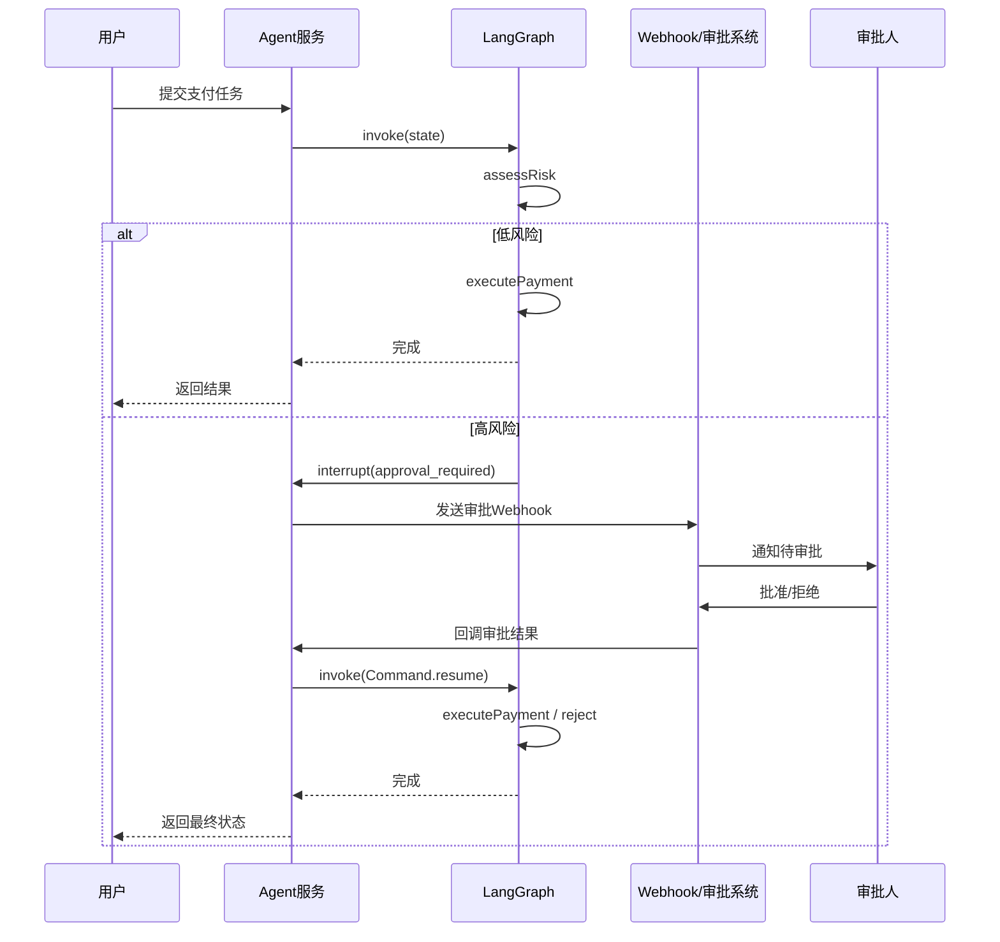
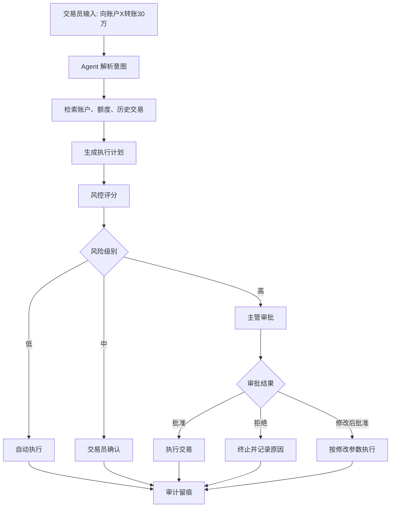

# 第 13 章：人机协作 — Human-in-the-Loop

# 第十三章 人机协作 — Human-in-the-Loop

当我们讨论 AI Agent 时，一个最容易被误解的点是：**“Agent 越智能，就越应该完全自动化。”**  
这在 demo 阶段看起来很诱人，但一旦进入真实业务，结论往往相反——**越接近关键业务，越需要人机协作（Human-in-the-Loop, HITL）**。

原因很简单：Agent 不是传统的确定性程序。它依赖概率模型做推理、规划、调用工具、生成文本与动作。即便整体效果很好，也无法像纯规则引擎那样对所有边界情况提供严格保证。因此，在高价值、高风险、高不确定性的流程中，系统必须允许人类在关键节点进行**审批、确认、引导、纠正甚至接管**。

这一章我们从原理走到实战，最后会实现一个基于 **LangGraph interrupt + webhook** 的审批流，并结合“金融交易 Agent”的案例，给出一套可落地的人机协作设计方案。

---

## 13.1 为什么 Agent 不能完全自主

很多团队在做 Agent 时，最初都以“无人值守”为目标。但真实世界里的系统，不只是“能不能做”，更关心“做错了怎么办”。

### 13.1.1 幻觉不是偶发 bug，而是概率性特征

LLM 的核心工作方式决定了它会根据上下文预测“最可能的下一个 token”。这带来很强的泛化能力，但也意味着：

- 它可能生成**看似合理但事实错误**的内容
- 它可能误解工具返回结果
- 它可能在规划多步任务时遗漏约束
- 它可能把“没查到”补全成“查到了”

在问答场景，幻觉可能只是信息错误；  
在工具调用场景，幻觉就可能变成**错误动作**。

例如一个采购 Agent：

- 用户说“帮我下单最便宜的 GPU 云主机”
- Agent 错把测试环境当生产环境
- 调用了真实采购接口
- 产生了实际费用

这时问题已经不是“回答错了”，而是“执行错了”。

### 13.1.2 对齐问题：模型目标不等于业务目标

模型通常被训练成“帮助用户完成请求”，但企业系统中还有大量隐性约束：

- 合规要求
- 审计要求
- 权限边界
- 风险偏好
- 成本预算
- 组织流程

用户说“把所有客户数据导出给我”，模型可能觉得这是一个可完成的任务；  
但业务系统必须先判断：

- 当前用户是否有权限
- 数据是否涉及敏感字段
- 是否需要主管审批
- 是否需要脱敏
- 是否需要留下审计日志

也就是说，**模型的“有帮助”不代表系统的“可执行”**。  
这就是为什么 Agent 的执行层必须被制度化约束，而不能完全交给模型自由发挥。

### 13.1.3 高风险操作必须可控、可追责、可回滚

不同任务的风险等级完全不同。

| 操作类型 | 风险等级 | 是否适合完全自主 |
|---|---:|---|
| 总结周报 | 低 | 通常可以 |
| 草拟邮件 | 低 | 通常可以 |
| 修改知识库文档 | 中 | 需要审阅 |
| 删除数据库记录 | 高 | 通常不可以 |
| 发起转账 | 高 | 必须审批 |
| 调整生产环境配置 | 高 | 必须强控 |

高风险操作有几个共同特征：

1. **影响真实世界**
   - 花钱
   - 发消息
   - 改配置
   - 写数据库
   - 触发外部系统

2. **后果不容易逆转**
   - 交易成交后无法撤回
   - 邮件发出后无法收回
   - 数据删除恢复成本高

3. **责任归属明确**
   - 谁批准的
   - 谁执行的
   - 执行依据是什么
   - 证据链是否完整

因此，Agent 不应该被视为“自动替代人”，而应该被设计成“在人的监督下高效工作”。

---

## 13.2 人机协作的五种介入模式

Human-in-the-Loop 不是单一机制，而是一组设计模式。不同任务、不同风险等级，需要不同的介入方式。

---

## 13.2.1 审批（Approval）

审批适用于：

- 高金额支付
- 交易执行
- 删除/覆盖关键数据
- 访问敏感数据
- 生产环境变更

特征是：

- Agent 先准备方案
- 不直接执行
- 等待指定角色批准
- 批准后才能继续

审批的核心不是“让人点一下按钮”，而是让责任链清晰：

- 谁发起
- 谁批准
- 批准依据是什么
- 执行内容是否被篡改

---

## 13.2.2 确认（Confirmation）

确认比审批更轻量，适合中风险操作，例如：

- 给客户发送邮件
- 创建工单
- 执行批量更新
- 覆盖已有草稿

确认通常面向任务发起者本人，而不是管理者。

例子：

> Agent：我已生成报价邮件，将发送给 12 位客户，是否发送？

这里不一定需要主管审批，但需要用户明确同意。

---

## 13.2.3 引导（Guidance）

引导发生在任务尚未明确，或者约束不足时。  
Agent 不应盲目猜测，而应主动向人类获取更精确信息。

例如：

- “帮我安排下周会议” → 需要知道参与人、时长、优先级
- “帮我分析销量下降原因” → 需要知道分析时间范围、商品线、指标口径
- “帮我选一个模型部署方案” → 需要知道预算、时延、并发

引导的目标是把“模糊任务”收敛成“可执行任务”。

---

## 13.2.4 纠正（Correction）

当 Agent 的计划、推理路径、工具选择出现偏差时，用户可以纠正它，而不是从头重来。

例如：

- Agent 选错了数据源
- Agent 误把“测试账户”当成“正式账户”
- Agent 计划调用错误 API
- Agent 理解错了用户意图

好的系统应该允许用户说：

- “不要用这个数据源”
- “只处理最近 7 天的数据”
- “不要真的执行，只生成 SQL”
- “金额超过 1 万时必须审批”

纠正机制的价值在于：  
**保留上下文、降低返工成本、减少错误放大。**

---

## 13.2.5 接管（Takeover）

接管是最强介入模式。它适用于：

- Agent 陷入循环
- 模型输出明显异常
- 工具调用连续失败
- 风险急剧上升
- 需要人工直接完成后续步骤

在接管模式下：

- Agent 暂停
- 当前上下文被保存
- 人类可以查看状态
- 人类手动执行或修改状态
- 后续可以选择恢复 Agent 或终止流程

很多生产级系统都需要“人工接管开关”，因为复杂系统永远会出现预期之外的情况。

---

## 13.3 设计模式：如何把人类嵌入 Agent 流程

真正难的不是“提供一个审批按钮”，而是把人类介入设计成系统的一部分。

---

## 13.3.1 检查点暂停（Checkpoint Pause）

这是最常见的 HITL 模式：  
当 Agent 走到关键节点时，主动暂停，等待外部输入。

典型检查点包括：

- 调用高风险工具之前
- 生成最终执行计划之后
- 低置信度决策之前
- 访问敏感资源之前
- 出现异常或冲突时

流程图如下：



检查点的关键不是暂停本身，而是暂停时必须保存：

- 当前状态
- 待执行动作
- 风险说明
- 审批所需上下文
- 可选动作（批准/拒绝/修改）

如果只告诉审批人“请审批”，而不给足信息，审批就会流于形式。

---

## 13.3.2 置信度阈值（Confidence Threshold）

不是每次都需要人工介入。  
更合理的做法是：**当模型或系统对决策缺乏把握时，再拉人进来。**

常见阈值来源：

- 模型自评置信度
- 多模型一致性
- 检索结果覆盖度
- 规则命中情况
- 历史成功率
- 风险评分

例如：

- 提取合同金额的置信度 > 0.95：自动继续
- 在知识库中找到 3 份相似案例且答案一致：自动继续
- 交易对手命中制裁名单模糊匹配：必须人工复核
- Agent 多次重试仍无法确定目标账户：请求人工确认

注意：  
LLM 的“自我置信”不总是可靠，因此实际系统中更适合将多个信号组合成**决策分数**，而不是只相信模型嘴上说“我很确定”。

一个简单的风险评分示意：

| 信号 | 分值 |
|---|---:|
| 金额 > 10,000 | +40 |
| 涉及真实支付 | +30 |
| 置信度 < 0.8 | +20 |
| 敏感数据访问 | +30 |
| 用户为管理员 | -10 |

总分：

- 0-29：自动执行
- 30-59：用户确认
- 60-89：主管审批
- 90+：双人审批或人工接管

---

## 13.3.3 权限分级（Permission Tiering）

Agent 不能拥有“无限权力”。  
应该像人类员工一样，根据角色、环境、操作类型分配权限。

一个典型的权限分级表：

| 权限级别 | 允许操作 |
|---|---|
| L0 只读 | 查询、检索、总结 |
| L1 草稿 | 生成草稿，不外发、不落库 |
| L2 低风险写入 | 创建工单、更新非关键字段 |
| L3 中风险执行 | 批量操作、发送外部通知 |
| L4 高风险执行 | 转账、删除数据、生产环境变更 |

设计要点：

1. **模型权限不高于用户权限**
2. **默认最小权限**
3. **高权限操作必须短时授权**
4. **敏感操作必须审计**
5. **生产环境与测试环境隔离**

这样即便 Agent 判断失误，损失也会被限制在权限边界内。

---

## 13.4 UX 设计：让用户理解 Agent 在做什么

很多 Agent 产品失败，不是因为模型太差，而是因为用户根本不知道系统在做什么、做到哪一步、为什么卡住、该如何干预。

Human-in-the-Loop 的 UX 目标不是“加一个审批页面”，而是建立**可理解、可预测、可干预**的用户体验。

---

## 13.4.1 展示“意图”而不是只展示“结果”

用户不仅关心“Agent 输出了什么”，还关心：

- 它准备做什么
- 为什么这么做
- 用了哪些数据
- 计划执行哪些动作
- 哪些地方存在风险

例如，不要只显示：

> 已准备执行转账。

而应该显示：

- 目标账户：招商银行 **1234**
- 金额：￥80,000
- 依据：用户指令 + 发票 #INV-20260501
- 风险原因：金额超过自动执行阈值 50,000
- 下一步：等待财务经理审批

这能显著提升用户信任感，也减少误批。

---

## 13.4.2 告诉用户“Agent 当前处于哪个状态”

一个好的 Agent 界面，至少应该有明确状态机：

- 正在理解任务
- 正在检索数据
- 正在生成计划
- 等待用户确认
- 等待主管审批
- 正在执行
- 执行完成
- 执行失败
- 已转人工接管

可以把状态可视化为时间线：



对于用户来说，“卡住”和“等待审批”是完全不同的感受。  
只要状态透明，用户焦虑就会降低很多。

---

## 13.4.3 干预入口必须就近、低摩擦

如果用户发现 Agent 的计划有误，不应该要求他：

1. 退出当前页面
2. 打开后台管理台
3. 找到任务日志
4. 提交一条纠正请求

正确做法是：  
在当前任务上下文中直接提供操作：

- 批准
- 拒绝
- 修改金额
- 更换收件人
- 切换数据源
- 转人工处理

也就是说，**干预必须嵌入当前工作流，而不是额外的工作流**。

---

## 13.4.4 给出“可操作的解释”

解释不是把 CoT 全量吐给用户，也不是输出一段空泛说明。  
好的解释应该服务于用户决策。

例如：

**坏解释：**

> 我综合分析认为这笔交易可能存在风险。

**好解释：**

> 风险原因：
> 1. 金额 300,000 超过自动交易阈值 50,000  
> 2. 交易对手账户首次出现  
> 3. KYC 资料缺失营业执照编号  
> 因此需要人工审批。

用户需要的是“为什么要我介入”，以及“我该看什么”。

---

## 13.4.5 审批界面要支持“修改后批准”

现实业务里，审批不是只有“同意/拒绝”。

更常见的是：

- 金额太高，改成 50,000 后批准
- 邮件内容需要删掉一段再发送
- 只能同步到测试环境，不能直接发生产
- 允许查询，但结果需要脱敏

因此审批动作至少应支持：

- Approve
- Reject
- Revise and Approve
- Escalate
- Take Over

这会比“单一确认按钮”更符合企业流程。

---

## 13.5 实战：用 LangGraph interrupt + webhook 实现审批流

下面我们实现一个最小可运行的审批流：

- 用户发起支付任务
- Agent 判断金额是否超过阈值
- 超过阈值则调用 `interrupt` 暂停图执行
- 服务端通过 webhook 把审批请求推给外部系统
- 审批人点击批准/拒绝
- 系统恢复图执行并完成后续动作

下面示例以 **TypeScript** 为主，使用 Node.js + Express。

> 为了便于阅读，示例聚焦 HITL 主流程，不展开数据库和认证系统。生产环境需要补充持久化、签名校验、重放保护等能力。

---

## 13.5.1 安装依赖

```bash
npm init -y
npm install express zod
npm install @langchain/langgraph @langchain/core
npm install typescript ts-node-dev @types/node @types/express -D
```

`tsconfig.json`：

```json
{
  "compilerOptions": {
    "target": "ES2022",
    "module": "CommonJS",
    "moduleResolution": "Node",
    "strict": true,
    "esModuleInterop": true,
    "outDir": "dist",
    "skipLibCheck": true
  }
}
```

---

## 13.5.2 定义状态与审批存储

先实现一个内存版审批中心。生产环境应替换为 Redis/PostgreSQL。

```ts
// src/store.ts
export type ApprovalStatus = "pending" | "approved" | "rejected";

export interface ApprovalRequest {
  id: string;
  threadId: string;
  taskId: string;
  action: string;
  amount: number;
  reason: string;
  status: ApprovalStatus;
  createdAt: number;
  decidedAt?: number;
  decidedBy?: string;
  comment?: string;
}

const approvals = new Map<string, ApprovalRequest>();

export function createApproval(req: ApprovalRequest) {
  approvals.set(req.id, req);
  return req;
}

export function getApproval(id: string) {
  return approvals.get(id);
}

export function updateApproval(
  id: string,
  patch: Partial<ApprovalRequest>
): ApprovalRequest | undefined {
  const current = approvals.get(id);
  if (!current) return undefined;
  const updated = { ...current, ...patch };
  approvals.set(id, updated);
  return updated;
}

export function listApprovals() {
  return Array.from(approvals.values());
}
```

---

## 13.5.3 模拟 webhook 推送

这里我们先用 `console.log` 模拟 webhook 发送。  
真实环境中你可以推送到：

- 企业微信 / 钉钉
- Slack / Teams
- 内部审批系统
- 邮件通知服务

```ts
// src/webhook.ts
import { ApprovalRequest } from "./store";

export async function sendApprovalWebhook(req: ApprovalRequest) {
  const payload = {
    type: "payment_approval_required",
    approvalId: req.id,
    threadId: req.threadId,
    taskId: req.taskId,
    action: req.action,
    amount: req.amount,
    reason: req.reason,
    approveUrl: `http://localhost:3000/approvals/${req.id}/approve`,
    rejectUrl: `http://localhost:3000/approvals/${req.id}/reject`
  };

  console.log("=== WEBHOOK OUT ===");
  console.log(JSON.stringify(payload, null, 2));
}
```

---

## 13.5.4 用 LangGraph 构建可中断流程

下面是核心代码。  
当金额超过阈值时，图会进入人工审批节点，并触发 `interrupt`。

```ts
// src/graph.ts
import { StateGraph, START, END, interrupt, Command, MemorySaver } from "@langchain/langgraph";
import { randomUUID } from "crypto";
import { createApproval } from "./store";
import { sendApprovalWebhook } from "./webhook";

export interface PaymentState {
  taskId: string;
  userId: string;
  amount: number;
  payee: string;
  reason: string;
  riskLevel?: "low" | "high";
  approvalId?: string;
  approvalDecision?: "approved" | "rejected";
  executionResult?: string;
}

const CHECKPOINT_AMOUNT = 50000;

async function assessRisk(state: PaymentState): Promise<Partial<PaymentState>> {
  const riskLevel = state.amount >= CHECKPOINT_AMOUNT ? "high" : "low";
  return { riskLevel };
}

async function humanApprovalNode(state: PaymentState): Promise<Partial<PaymentState>> {
  const approvalId = randomUUID();

  createApproval({
    id: approvalId,
    threadId: state.taskId,
    taskId: state.taskId,
    action: "transfer_funds",
    amount: state.amount,
    reason: state.reason,
    status: "pending",
    createdAt: Date.now()
  });

  await sendApprovalWebhook({
    id: approvalId,
    threadId: state.taskId,
    taskId: state.taskId,
    action: "transfer_funds",
    amount: state.amount,
    reason: state.reason,
    status: "pending",
    createdAt: Date.now()
  });

  const decision = interrupt({
    type: "approval_required",
    approvalId,
    message: `Payment of ${state.amount} to ${state.payee} requires approval`
  });

  return {
    approvalId,
    approvalDecision: decision?.decision
  };
}

async function executePayment(state: PaymentState): Promise<Partial<PaymentState>> {
  if (state.approvalDecision === "rejected") {
    return {
      executionResult: `Payment rejected by human reviewer`
    };
  }

  return {
    executionResult: `Transferred ${state.amount} to ${state.payee} for ${state.reason}`
  };
}

function routeAfterRisk(state: PaymentState) {
  if (state.riskLevel === "high") return "humanApproval";
  return "executePayment";
}

const graph = new StateGraph<PaymentState>({
  channels: {}
})
  .addNode("assessRisk", assessRisk)
  .addNode("humanApproval", humanApprovalNode)
  .addNode("executePayment", executePayment)
  .addEdge(START, "assessRisk")
  .addConditionalEdges("assessRisk", routeAfterRisk, ["humanApproval", "executePayment"])
  .addEdge("humanApproval", "executePayment")
  .addEdge("executePayment", END);

const checkpointer = new MemorySaver();

export const paymentGraph = graph.compile({ checkpointer });
```

---

## 13.5.5 提供 HTTP 接口：创建任务、审批、恢复执行

这里我们做三个接口：

1. `POST /tasks/payment`：发起支付任务
2. `POST /approvals/:id/approve`：批准
3. `POST /approvals/:id/reject`：拒绝

```ts
// src/server.ts
import express from "express";
import { randomUUID } from "crypto";
import { paymentGraph, PaymentState } from "./graph";
import { getApproval, updateApproval, listApprovals } from "./store";
import { Command } from "@langchain/langgraph";

const app = express();
app.use(express.json());

app.post("/tasks/payment", async (req, res) => {
  const taskId = randomUUID();

  const input: PaymentState = {
    taskId,
    userId: req.body.userId ?? "u-001",
    amount: Number(req.body.amount),
    payee: req.body.payee,
    reason: req.body.reason
  };

  const config = {
    configurable: {
      thread_id: taskId
    }
  };

  const result = await paymentGraph.invoke(input, config);

  res.json({
    ok: true,
    taskId,
    result
  });
});

app.get("/approvals", (_req, res) => {
  res.json(listApprovals());
});

app.post("/approvals/:id/approve", async (req, res) => {
  const approval = getApproval(req.params.id);
  if (!approval) {
    return res.status(404).json({ error: "approval not found" });
  }

  updateApproval(approval.id, {
    status: "approved",
    decidedAt: Date.now(),
    decidedBy: req.body.reviewer ?? "manager-001",
    comment: req.body.comment ?? ""
  });

  const result = await paymentGraph.invoke(
    new Command({
      resume: {
        decision: "approved"
      }
    }),
    {
      configurable: {
        thread_id: approval.threadId
      }
    }
  );

  res.json({
    ok: true,
    approvalId: approval.id,
    result
  });
});

app.post("/approvals/:id/reject", async (req, res) => {
  const approval = getApproval(req.params.id);
  if (!approval) {
    return res.status(404).json({ error: "approval not found" });
  }

  updateApproval(approval.id, {
    status: "rejected",
    decidedAt: Date.now(),
    decidedBy: req.body.reviewer ?? "manager-001",
    comment: req.body.comment ?? ""
  });

  const result = await paymentGraph.invoke(
    new Command({
      resume: {
        decision: "rejected"
      }
    }),
    {
      configurable: {
        thread_id: approval.threadId
      }
    }
  );

  res.json({
    ok: true,
    approvalId: approval.id,
    result
  });
});

app.listen(3000, () => {
  console.log("server started at http://localhost:3000");
});
```

---

## 13.5.6 运行与测试

启动：

```bash
npx ts-node-dev src/server.ts
```

### 发起一个低风险任务

```bash
curl -X POST http://localhost:3000/tasks/payment \
  -H "Content-Type: application/json" \
  -d '{
    "userId": "alice",
    "amount": 1200,
    "payee": "Vendor-A",
    "reason": "office supplies"
  }'
```

因为金额低于 50,000，会直接执行。

### 发起一个高风险任务

```bash
curl -X POST http://localhost:3000/tasks/payment \
  -H "Content-Type: application/json" \
  -d '{
    "userId": "alice",
    "amount": 80000,
    "payee": "Vendor-B",
    "reason": "quarterly settlement"
  }'
```

这时控制台会打印 webhook 内容，并且图会暂停在 `interrupt`。

查看审批列表：

```bash
curl http://localhost:3000/approvals
```

批准：

```bash
curl -X POST http://localhost:3000/approvals/<approval-id>/approve \
  -H "Content-Type: application/json" \
  -d '{
    "reviewer": "finance-manager",
    "comment": "approved"
  }'
```

拒绝：

```bash
curl -X POST http://localhost:3000/approvals/<approval-id>/reject \
  -H "Content-Type: application/json" \
  -d '{
    "reviewer": "finance-manager",
    "comment": "counterparty not verified"
  }'
```

---

## 13.5.7 流程图：LangGraph + Webhook 审批流



---

## 13.5.8 Python 辅助示例：外部审批回调脚本

如果审批系统是 Python 写的，可以这样调用回调接口。

```python
# approval_callback.py
import requests

BASE_URL = "http://localhost:3000"
approval_id = "替换成真实 approval id"

resp = requests.post(
    f"{BASE_URL}/approvals/{approval_id}/approve",
    json={
        "reviewer": "finance-manager",
        "comment": "approved by external workflow"
    },
    timeout=10
)

print(resp.status_code)
print(resp.json())
```

这个示例说明：  
**审批端和 Agent 执行端可以完全解耦**。  
Agent 只负责暂停与恢复，审批 UI 可以来自任意系统。

---

## 13.6 渐进式自治：从人工审批到全自动的演进路径

企业引入 Agent 时，不应一步到位追求全自动。  
更可行的路线是**渐进式自治（Progressive Autonomy）**。

---

## 13.6.1 阶段一：人工主导，Agent 辅助

特点：

- Agent 负责理解任务、生成草稿、收集材料
- 最终动作由人手动执行
- 重点是积累数据和建立信任

适合早期上线：

- 风险最低
- 容易审计
- 用户更愿意接受

例如交易 Agent 在这个阶段只做：

- 识别交易意图
- 汇总账户信息
- 生成执行建议
- 给出风险说明

但不真正下单。

---

## 13.6.2 阶段二：半自动，关键节点审批

特点：

- 低风险动作自动执行
- 高风险动作必须审批
- 审批策略由规则和评分驱动

这是大多数企业最现实的阶段。  
你会发现，80% 的价值往往在这个阶段就能释放出来，因为大量低风险、重复性操作已经被自动化。

---

## 13.6.3 阶段三：默认自动，异常才介入

特点：

- 系统在多数场景自动完成
- 只有异常、低置信度、边界情况才请求人工
- 审批成为“保险丝”而非常态

要进入这一阶段，前提是：

- 有足够的历史数据
- 风险模型稳定
- 监控和回滚机制成熟
- 审计体系完善

---

## 13.6.4 阶段四：条件化全自动

全自动不是“永远不需要人”，而是：

- 在明确边界内自动
- 边界外立即降级为人工协作

例如：

- 小额、白名单交易对手、工作时间内、资料齐全 → 自动执行
- 其他任何情况 → 进入审批

也就是说，真正成熟的自治不是“没有人”，而是“系统知道什么时候必须找人”。

---

## 13.6.5 如何判断是否可以提高自治级别

可以观察以下指标：

| 指标 | 含义 |
|---|---|
| 自动执行成功率 | 自动任务是否稳定完成 |
| 人工驳回率 | 审批是否经常否决 Agent 决策 |
| 纠正率 | 用户是否经常修改 Agent 输出 |
| 风险事件数 | 是否产生误操作、违规、投诉 |
| 平均处理时长 | 自动化是否显著提升效率 |
| 用户信任度 | 用户是否愿意放权 |

如果某类任务：

- 自动执行成功率高
- 人工驳回率低
- 风险事件接近零

就可以尝试提高自治等级。

---

## 13.7 案例：金融交易 Agent 的人机协作流程设计

下面我们用一个更贴近生产的案例，把前面的设计原则串起来。

假设你要设计一个**金融交易 Agent**，负责协助机构客户完成转账、下单、对账和风控核验。

这类场景有几个显著特征：

- 金额高
- 风险高
- 强合规
- 审计严格
- 用户角色复杂

因此，它天然需要深度 HITL 设计。

---

## 13.7.1 核心参与角色

| 角色 | 职责 |
|---|---|
| 交易员 | 发起交易请求 |
| Agent | 解析意图、补全信息、调用工具、生成执行计划 |
| 风控系统 | 校验额度、黑名单、异常模式 |
| 审批人/主管 | 审批高风险交易 |
| 合规/审计 | 追溯记录、抽查、留档 |
| 执行系统 | 真正提交订单或转账指令 |

---

## 13.7.2 一条完整的人机协作流程



---

## 13.7.3 风险分层策略

金融场景中，不能只看金额。  
常见风险因子包括：

- 金额是否超过阈值
- 是否首次向该账户交易
- 账户是否在白名单
- 交易时间是否异常
- 是否跨境
- 是否涉及受限行业
- KYC 资料是否完整
- 用户历史行为是否异常
- 指令是否与上下文矛盾

可以定义一个策略表：

| 条件 | 动作 |
|---|---|
| 白名单账户 + 小额 + 工作时间 | 自动执行 |
| 非白名单 + 中额 | 用户确认 |
| 大额 + 首次交易 | 主管审批 |
| 命中黑名单/制裁名单 | 自动拒绝并转人工 |
| 资料不完整 | 暂停并要求补件 |

---

## 13.7.4 审批界面应该展示什么

审批人不应该被迫阅读一大段自然语言聊天记录。  
最有效的是结构化信息卡片：

- 交易类型：转账
- 金额：300,000
- 币种：CNY
- 付款账户：XX 资金户
- 收款账户：尾号 1234
- 收款方名称：某供应商有限公司
- 发起人：交易员 Alice
- 业务原因：季度结算
- 风险提示：
  - 首次交易对手
  - 金额超过 50,000
  - 对手方营业执照待复核
- Agent 建议：暂缓执行，需主管审批
- 可选动作：
  - 批准
  - 拒绝
  - 修改金额后批准
  - 转合规复核
  - 人工接管

这种 UI 设计的本质是：  
**让审批成为基于证据的决策，而不是基于感觉的点击。**

---

## 13.7.5 审计日志设计

金融场景里，审计日志和执行本身同样重要。  
至少要记录：

- 原始用户请求
- Agent 解析后的结构化意图
- 检索到的关键证据
- 风险评分和命中的规则
- 待执行动作快照
- 谁审批
- 审批时间
- 审批意见
- 最终执行结果
- 执行系统返回值
- 是否发生人工修改

建议日志结构采用事件流形式，例如：

```json
{
  "taskId": "txn-20260506-001",
  "events": [
    {
      "type": "user_request_received",
      "timestamp": 1746500000,
      "payload": {
        "text": "向供应商A转账30万"
      }
    },
    {
      "type": "agent_plan_created",
      "timestamp": 1746500001,
      "payload": {
        "amount": 300000,
        "payee": "供应商A",
        "action": "transfer_funds"
      }
    },
    {
      "type": "risk_scored",
      "timestamp": 1746500002,
      "payload": {
        "score": 85,
        "factors": ["high_amount", "new_counterparty"]
      }
    },
    {
      "type": "approval_required",
      "timestamp": 1746500003,
      "payload": {
        "approverRole": "finance_manager"
      }
    },
    {
      "type": "approval_granted",
      "timestamp": 1746500010,
      "payload":
